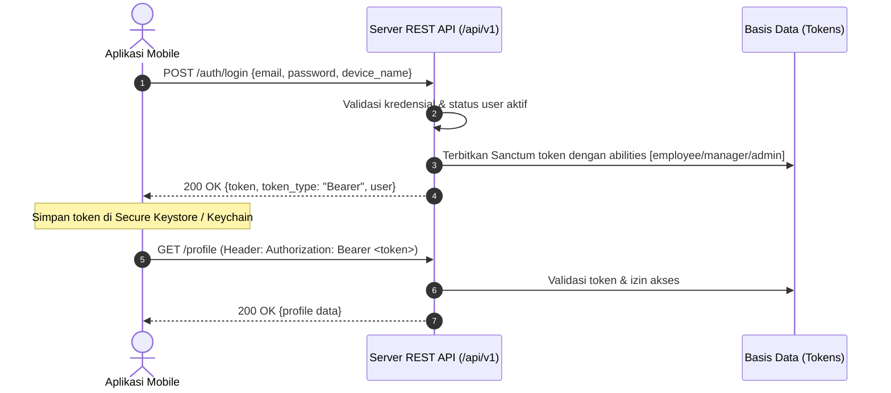

# 📱 Panduan Integrasi Mobile REST API — HR Group Enterprise

Dokumentasi teknis resmi implementasi Mobile REST API (Android, iOS, Flutter, React Native) untuk sistem **HR Group Enterprise**.

- **Base URL (Lokal):** `http://127.0.0.1:8003/api/v1`
- **Base URL (Produksi):** `https://api.hrgroup.enterprise/api/v1`
- **Spesifikasi Lengkap:** [`docs/api/openapi.yaml`](./openapi.yaml) (OpenAPI 3.1)
- **Status Pengujian:** ✅ **86 Tests Lulus (100% PHPUnit Suite)**

---

## 📑 Daftar Isi

1. [Arsitektur Keamanan & Autentikasi](#1-arsitektur-keamanan--autentikasi)
2. [Mekanisme Presensi Anti-Fraud Mobile](#2-mekanisme-presensi-anti-fraud-mobile)
3. [Format Response & Penanganan Error](#3-format-response--penanganan-error)
4. [Daftar 28 Endpoint API](#4-daftar-28-endpoint-api)
5. [Contoh Kasus & Panduan cURL](#5-contoh-kasus--panduan-curl)
6. [Panduan Pengujian Otomatis](#6-panduan-pengujian-otomatis)

---

## 1. Arsitektur Keamanan & Autentikasi

Aplikasi mobile menggunakan **Laravel Sanctum Bearer Token** dengan sistem *Token Abilities* berbasis peran pengguna.



### Hak Akses (Token Abilities)
- `employee`: Akses profil pribadi, shift pribadi, presensi, pengajuan izin, dan slip gaji sendiri.
- `manager`: Hak akses employee + pembuatan jadwal shift cabang, persetujuan izin cabang, generate QR code presensi cabang, dan laporan payroll cabang.
- `admin`: Hak akses penuh ke seluruh cabang, master data karyawan, dan konfigurasi sistem.

---

## 2. Mekanisme Presensi Anti-Fraud Mobile

Sistem menerapkan validasi berlapis 4 tingkat untuk menjamin keaslian kehadiran:

1. **Dynamic Rolling QR Code:**
   - QR code cabang diperbarui setiap 30 detik (`HMAC-SHA256`).
   - Mencegah foto QR dibagikan ke karyawan lain di luar lokasi.
2. **Geofencing GPS:**
   - Koordinat latitude & longitude dihitung terhadap titik cabang menggunakan formula Haversine.
   - Presensi diterima hanya jika jarak $\le$ `radius_m` cabang dan akurasi GPS $\le$ 100 meter.
3. **Hardware Device Binding:**
   - Karyawan hanya dapat melakukan presensi dari perangkat terdaftar (`device_hash`).
   - Mengikat UUID perangkat mobile ke akun karyawan.
4. **Interactive Challenge Replay Protection:**
   - Token tantangan sekali pakai (`attendance_challenge`) diterbitkan saat memuat layar presensi dan langsung dihancurkan setelah check-in berhasil.

---

## 3. Format Response & Penanganan Error

### Response Berhasil
```json
{
  "success": true,
  "message": "Operasi berhasil dilakukan.",
  "data": { ... }
}
```

### Response List Berhalaman (Pagination)
```json
{
  "success": true,
  "data": [ ... ],
  "meta": {
    "current_page": 1,
    "per_page": 15,
    "total": 45,
    "last_page": 3
  }
}
```

### Response Error
```json
{
  "success": false,
  "message": "Lokasi di luar area cabang atau akurasi GPS rendah.",
  "errors": {
    "latitude": ["Jarak ke cabang melebihi 100 meter."]
  }
}
```

### Daftar HTTP Status Code
| Kode | Makna | Kondisi Penggunaan |
|------|-------|--------------------|
| `200` | OK | Permintaan berhasil (GET, PUT, PATCH, DELETE) |
| `201` | Created | Resource baru berhasil dibuat (POST check-in, store shift, dll.) |
| `401` | Unauthorized | Token hilang, kedaluwarsa, atau tidak valid |
| `403` | Forbidden | Role tidak mencukupi atau akun dinonaktifkan |
| `404` | Not Found | Resource tidak ditemukan |
| `409` | Conflict | Konflik bisnis logic (shift bentrok, pengajuan tumpang tindih) |
| `422` | Unprocessable Entity | Validasi input gagal atau di luar geofence |
| `429` | Too Many Requests | Rate limit terlampaui (proteksi brute force) |

---

## 4. Daftar 28 Endpoint API

### 🔐 Autentikasi (`/api/v1/auth`)
| No | Method | Endpoint | Akses | Deskripsi |
|----|--------|----------|-------|-----------|
| 1 | `POST` | `/auth/login` | Public | Login email + password → Sanctum Bearer token |
| 2 | `POST` | `/auth/logout` | Auth | Cabut token aktif yang sedang dipakai |
| 3 | `GET` | `/auth/me` | Auth | Cek profil & token abilities pengguna |
| 4 | `POST` | `/auth/device` | Auth | Daftarkan identitas perangkat mobile (`device_hash`) |
| 5 | `POST` | `/auth/refresh` | Auth | Rotasi token sesi aktif |

### 👤 Profil & Status Hari Ini (`/api/v1/profile`)
| No | Method | Endpoint | Akses | Deskripsi |
|----|--------|----------|-------|-----------|
| 6 | `GET` | `/profile` | Auth | Profil lengkap karyawan, jabatan, dan cabang |
| 7 | `GET` | `/profile/today` | Auth | Shift hari ini, status presensi, dan token challenge |

### 📍 Presensi & QR Code (`/api/v1/attendance`)
| No | Method | Endpoint | Akses | Deskripsi |
|----|--------|----------|-------|-----------|
| 8 | `POST` | `/attendance/checkin` | Employee | Check-in via QR code + geofence koordinat GPS |
| 9 | `POST` | `/attendance/checkout` | Employee | Check-out shift aktif + hitung lembur otomatis |
| 10 | `GET` | `/attendance/history` | Auth | Riwayat presensi terpaginasi (pribadi / cabang) |
| 11 | `GET` | `/attendance/qr` | Manager+ | Generate dynamic QR code cabang (berlaku 30s) |
| 12 | `POST` | `/attendance/{id}/exception` | Employee | Ajukan kendala/pengecualian presensi bermasalah |

### 📅 Manajemen Shift (`/api/v1/shifts`)
| No | Method | Endpoint | Akses | Deskripsi |
|----|--------|----------|-------|-----------|
| 13 | `GET` | `/shifts` | Auth | Daftar jadwal shift (filter: `date`, `month`, `status`) |
| 14 | `GET` | `/shifts/{id}` | Auth | Detail lengkap jadwal shift + absensi |
| 15 | `POST` | `/shifts` | Manager+ | Buat shift baru status draf (validasi anti-bentrok) |
| 16 | `PATCH`| `/shifts/{id}` | Manager+ | Perbarui jam / tanggal jadwal shift draf |
| 17 | `POST` | `/shifts/{id}/approve` | Manager+ | Setujui shift draf agar bisa dipresensikan |
| 18 | `DELETE`| `/shifts/{id}` | Manager+ | Hapus / batalkan shift tanpa rekaman absensi |

### 🏖️ Perizinan & Sakit (`/api/v1/leave`)
| No | Method | Endpoint | Akses | Deskripsi |
|----|--------|----------|-------|-----------|
| 19 | `GET` | `/leave` | Auth | Daftar pengajuan izin (filter: `type`, `status`) |
| 20 | `POST` | `/leave` | Employee | Ajukan izin / sakit (dukung upload surat dokter) |
| 21 | `GET` | `/leave/{id}` | Auth | Detail pengajuan izin dan status keputusan per hari |
| 22 | `POST` | `/leave/{id}/review` | Manager+ | Setujui / tolak pengajuan izin per tanggal |
| 23 | `DELETE`| `/leave/{id}` | Auth | Batalkan permohonan izin (status pending) |

### 💰 Payroll & Slip Gaji (`/api/v1/payroll`)
| No | Method | Endpoint | Akses | Deskripsi |
|----|--------|----------|-------|-----------|
| 24 | `GET` | `/payroll/slip` | Auth | Slip gaji digital milik sendiri (`?month=YYYY-MM`) |
| 25 | `GET` | `/payroll/slip/{userId}` | Manager+ | Slip gaji karyawan tertentu di cabang |
| 26 | `GET` | `/payroll/summary` | Manager+ | Ringkasan finansial & blocker payroll cabang |

### 🏢 Master Data & Administrasi (`/api/v1/admin`)
| No | Method | Endpoint | Akses | Deskripsi |
|----|--------|----------|-------|-----------|
| 27 | `GET` | `/admin/employees` | Manager+ | Daftar karyawan cabang / seluruh perusahaan |
| 28 | `GET` | `/admin/branches` | Manager+ | Daftar cabang aktif beserta koordinat & radius |

---

## 5. Contoh Kasus & Panduan cURL

### 1. Login Karyawan
```bash
curl -X POST "http://127.0.0.1:8003/api/v1/auth/login" \
  -H "Content-Type: application/json" \
  -H "Accept: application/json" \
  -d '{
    "email": "karyawan@example.test",
    "password": "password",
    "device_name": "iPhone 15 Pro"
  }'
```

### 2. Dapatkan Status Kerja Hari Ini
```bash
curl -X GET "http://127.0.0.1:8003/api/v1/profile/today" \
  -H "Authorization: Bearer <TOKEN>" \
  -H "Accept: application/json"
```

### 3. Generate QR Code Cabang (Khusus Manager / Kasir)
```bash
curl -X GET "http://127.0.0.1:8003/api/v1/attendance/qr?branch_id=1" \
  -H "Authorization: Bearer <TOKEN_MANAGER>" \
  -H "Accept: application/json"
```

### 4. Check-In Presensi Mobile
```bash
curl -X POST "http://127.0.0.1:8003/api/v1/attendance/checkin" \
  -H "Authorization: Bearer <TOKEN_KARYAWAN>" \
  -H "Content-Type: application/json" \
  -H "Accept: application/json" \
  -d '{
    "shift_id": 14,
    "qr_code": "8A4F19C2",
    "latitude": -6.175392,
    "longitude": 106.827153,
    "accuracy": 12.0,
    "device_token": "dev_token_my_phone_123"
  }'
```

### 5. Check-Out Presensi Mobile
```bash
curl -X POST "http://127.0.0.1:8003/api/v1/attendance/checkout" \
  -H "Authorization: Bearer <TOKEN_KARYAWAN>" \
  -H "Content-Type: application/json" \
  -H "Accept: application/json" \
  -d '{
    "shift_id": 14,
    "latitude": -6.175392,
    "longitude": 106.827153,
    "accuracy": 10.0,
    "device_token": "dev_token_my_phone_123"
  }'
```

### 6. Pengajuan Sakit dengan Lampiran Surat Dokter
```bash
curl -X POST "http://127.0.0.1:8003/api/v1/leave" \
  -H "Authorization: Bearer <TOKEN_KARYAWAN>" \
  -H "Accept: application/json" \
  -F "type=sick" \
  -F "start_date=2026-11-01" \
  -F "end_date=2026-11-02" \
  -F "reason=Demam tinggi dan radang tenggorokan rawat jalan." \
  -F "certificate=@/path/to/surat_dokter.pdf"
```

### 7. Ambil Rincian Slip Gaji Digital
```bash
curl -X GET "http://127.0.0.1:8003/api/v1/payroll/slip?month=2026-10" \
  -H "Authorization: Bearer <TOKEN_KARYAWAN>" \
  -H "Accept: application/json"
```

---

## 6. Panduan Pengujian Otomatis

Seluruh endpoint mobile telah diuji dengan suite pengujian otomatis Feature PHPUnit:

```bash
# Menjalankan seluruh pengujian (Web + API)
/opt/homebrew/opt/php@8.4/bin/php ./vendor/bin/phpunit

# Menjalankan spesifik test API
/opt/homebrew/opt/php@8.4/bin/php ./vendor/bin/phpunit tests/Feature/Api/AuthApiTest.php
/opt/homebrew/opt/php@8.4/bin/php ./vendor/bin/phpunit tests/Feature/Api/AttendanceApiTest.php
/opt/homebrew/opt/php@8.4/bin/php ./vendor/bin/phpunit tests/Feature/Api/LeaveApiTest.php
/opt/homebrew/opt/php@8.4/bin/php ./vendor/bin/phpunit tests/Feature/Api/PayrollApiTest.php

# Menjalankan verifikasi E2E UI Blade (Zero Regression)
/opt/homebrew/opt/php@8.4/bin/php scripts/verify-ui-e2e.php
```

Hasil verifikasi:
```text
OK (86 tests, 350 assertions)
🎉 ALL BLADE VIEWS & E2E FLOWS RENDERED SUCCESSFULLY (incl. Payroll Slip)!
```
