# Dokumen Desain Basis Data & Spesifikasi Struktur Data
## HR Group — Human Resource, Attendance, & Payroll System

---

| Parameter Dokumen | Keterangan |
| :--- | :--- |
| **Sistem / Proyek** | HR Group Browser MVP |
| **Tipe Dokumen** | Database Architecture & Data Dictionary Specification |
| **Versi Dokumen** | 1.0.0 |
| **RDBMS Didukung** | SQLite 3.35+ (Default MVP) / MySQL 8.0+ / PostgreSQL 14+ |
| **Standar Penamaan** | `snake_case` (Tabel & Kolom), `Plural` (Nama Tabel) |
| **Standar Waktu** | Datetime ISO-8601 berbasis server `Asia/Jakarta` (WIB) |

---

## 1. Pendahuluan & Prinsip Desain Basis Data

### 1.1 Tujuan Dokumen
Dokumen ini dirancang sebagai cetak biru (*blueprint*) teknis resmi yang mendefinisikan rancangan basis data sistem **HR Group**. Dokumen ini mencakup model data konseptual, diagram relasi entitas fisik (ERD), kamus data komprehensif, struktur skema dokumen semi-terstruktur (JSON *payload*), strategi pengindeksan, serta kontrol integritas dan keamanan data.

### 1.2 Prinsip-Prinsip Arsitektur Data
1. **Normalisasi & Transparansi Data:** Sebagian besar tabel dirancang memenuhi standar bentuk normal ketiga (3NF) untuk menghindari anomali pembaruan (*update anomaly*).
2. **Snapshot Finansial (*Immutability*):** Perhitungan payroll yang disetujui disimpan dalam format *frozen snapshot* (JSON *breakdown* dan nilai nominal *net* tersimpan di `payroll_lines`) agar perubahan tarif atau formula di kemudian hari tidak mengubah nilai historis yang telah dibayarkan.
3. **Penyimpanan Telemetri Semi-Terstruktur (Hybrid Relational-JSON):** Data telemetri yang fleksibel (koordinat GPS, indikator risiko, akurasi, dan metadata bukti perizinan) disimpan sebagai teks JSON terstruktur di dalam kolom khusus.
4. **Pencegahan Penghapusan Data Kasar (*Soft Inactivation / Auditing*):** Rekam data penting (karyawan, cabang, riwayat presensi) tidak dihapus secara permanen (`DELETE`), melainkan dinonaktifkan (`active = false`) atau ditandai statusnya guna menjaga keabsahan riwayat penggajian dan jejak audit.

---

## 2. Diagram Relasi Entitas (Entity Relationship Diagram)

Diagram berikut merepresentasikan seluruh entitas domain inti HR, hubungan relasional, kardinalitas, dan kunci relasi (*foreign keys*):

```mermaid
erDiagram
    BRANCHES ||--o{ USERS : "memiliki karyawan"
    BRANCHES ||--o{ SHIFTS : "lokasi kerja shift"
    BRANCHES ||--o{ PAYROLL_RUNS : "cakupan penggajian"
    POSITIONS ||--o{ USERS : "klasifikasi jabatan"

    USERS ||--o{ SHIFTS : "dijadwalkan kerja"
    USERS ||--o{ ATTENDANCES : "mencatat presensi"
    USERS ||--o{ ATTENDANCE_ATTEMPTS : "memiliki riwayat coba"
    USERS ||--o{ ATTENDANCE_EXCEPTIONS : "mengajukan tiket kendala"
    USERS ||--o{ LEAVE_REQUESTS : "mengajukan izin sakit"
    USERS ||--o{ PAYROLL_ADJUSTMENTS : "menerima penyesuaian gaji"
    USERS ||--o{ PAYROLL_LINES : "menerima slip gaji"
    USERS ||--o{ AUDIT_LOGS : "pelaku perubahan (actor)"

    SHIFTS ||--o| ATTENDANCES : "menghasilkan catatan hadir"
    SHIFTS ||--o{ ATTENDANCE_EXCEPTIONS : "terkait insiden shift"
    SHIFTS ||--o{ ATTENDANCE_ATTEMPTS : "terkait log percobaan"

    LEAVE_REQUESTS ||--o{ LEAVE_DAYS : "memiliki rincian harian"
    PAYROLL_RUNS ||--o{ PAYROLL_LINES : "memiliki rincian karyawan"

    BRANCHES {
        bigint id PK
        string code UK "Kode unik cabang"
        string name "Nama cabang"
        decimal latitude "Garis lintang (-90 s/d 90)"
        decimal longitude "Garis bujur (-180 s/d 180)"
        int radius_m "Radius validasi geofence"
        string qr_secret "Kunci rahasia HMAC QR"
        boolean active "Status operasional cabang"
    }

    POSITIONS {
        bigint id PK
        string name UK "Nama jabatan unik"
    }

    SETTINGS {
        string key PK "Kunci konfigurasi"
        string value "Nilai parameter"
    }

    USERS {
        bigint id PK
        string name "Nama lengkap"
        string email UK "Email login"
        string password "Hash kata sandi"
        string role "admin | manager | employee"
        bigint branch_id FK "Relasi ke cabang"
        bigint position_id FK "Relasi ke jabatan"
        date hired_at "Tanggal mulai bekerja"
        date ended_at "Tanggal akhir masa kerja"
        bigint base_salary "Gaji pokok bulanan (Rp)"
        boolean active "Status keaktifan akun"
        string device_hash "Hash token perangkat"
    }

    SHIFTS {
        bigint id PK
        bigint user_id FK "ID Karyawan"
        bigint branch_id FK "ID Cabang"
        datetime start_at "Waktu mulai shift"
        datetime end_at "Waktu selesai shift"
        string status "draft | approved"
        int version "Nomor versi revisi jadwal"
        bigint approved_by FK "ID Admin penyetujui"
        datetime approved_at "Waktu persetujuan"
    }

    ATTENDANCES {
        bigint id PK
        bigint shift_id FK,UK "1 catatan per shift"
        bigint user_id FK "ID Karyawan"
        datetime checkin_at "Waktu masuk riil"
        datetime checkout_at "Waktu pulang riil"
        string status "present | late | absent | corrected"
        int late_minutes "Total menit terlambat"
        int late_units "Unit potongan keterlambatan"
        int overtime_minutes "Menit lembur bersih"
        bigint overtime_approved_by FK "ID Manager penyetujui lembur"
        text checkin_evidence "JSON bukti masuk"
        text checkout_evidence "JSON bukti pulang"
        text flags "JSON penanda anomali"
    }

    ATTENDANCE_ATTEMPTS {
        bigint id PK
        bigint user_id FK "ID Karyawan"
        bigint shift_id FK "ID Shift terkait"
        string action "in | out"
        string result "accepted | rejected"
        string reason "Alasan penolakan"
        text evidence "JSON telemetri perangkat"
        datetime server_at "Waktu stempel jam server"
    }

    ATTENDANCE_EXCEPTIONS {
        bigint id PK
        bigint user_id FK "ID Karyawan pemohon"
        bigint shift_id FK "ID Shift terkait"
        string action "in | out"
        text reason "Uraian kendala teknis"
        string status "pending | approved | rejected"
        bigint reviewed_by FK "ID Manager peninjau"
        text review_note "Catatan peninjauan"
        datetime reviewed_at "Waktu peninjauan"
    }

    LEAVE_REQUESTS {
        bigint id PK
        bigint user_id FK "ID Karyawan yang izin"
        bigint created_by FK "ID Pembuat pengajuan"
        string type "leave | sick"
        date start_date "Tanggal mulai izin"
        date end_date "Tanggal selesai izin"
        text reason "Alasan perizinan"
        string certificate_path "Path file surat dokter"
        string certificate_name "Nama asli file lampiran"
        string status "pending | approved | partial | rejected"
        bigint reviewed_by FK "ID Manager peninjau"
        text review_note "Catatan keputusan"
        datetime reviewed_at "Waktu keputusan"
    }

    LEAVE_DAYS {
        bigint id PK
        bigint leave_request_id FK "ID Permohonan izin"
        date date "Tanggal spesifik"
        string status "pending | approved | rejected"
        boolean paid "Apakah hari ini berbayar"
    }

    PAYROLL_RUNS {
        bigint id PK
        bigint branch_id FK "ID Cabang yang digaji"
        string month "Periode tahun-bulan (YYYY-MM)"
        string status "draft | approved | locked"
        bigint approved_by FK "ID Admin penyetujui"
        datetime approved_at "Waktu persetujuan"
        bigint locked_by FK "ID Admin pengunci"
        datetime locked_at "Waktu penguncian final"
    }

    PAYROLL_LINES {
        bigint id PK
        bigint payroll_run_id FK "ID Periode payroll"
        bigint user_id FK "ID Karyawan"
        text breakdown "JSON rekapan komputasi"
        bigint net "Gaji bersih final (Rp)"
    }

    PAYROLL_ADJUSTMENTS {
        bigint id PK
        bigint user_id FK "ID Karyawan"
        string month "Periode bulan (YYYY-MM)"
        bigint amount "Nominal penyesuaian (+ / - Rp)"
        text reason "Alasan koreksi manual"
        bigint created_by FK "ID Admin pembuat"
    }

    AUDIT_LOGS {
        bigint id PK
        bigint actor_id FK "ID Pengguna pelaku aksi"
        string subject_type "Nama entitas / tabel"
        bigint subject_id "ID rekaman yang diubah"
        string action "Jenis mutasi / aksi"
        text before "JSON kondisi sebelum aksi"
        text after "JSON kondisi sesudah aksi"
        text reason "Alasan perubahan"
        string ip "Alamat IP asal request"
        datetime created_at "Waktu stempel aksi"
    }
```



---

## 3. Kamus Data Rinci per Entitas (Data Dictionary)

### 3.1 Grup Entitas 1: Organisasi & Keamanan Pengguna

#### Tabel `branches` (Data Cabang Fisik & Parameter Geofence)
| Nama Kolom | Tipe Data | Nullable | Default | Batasan & Aturan | Deskripsi Bisnis |
| :--- | :--- | :---: | :---: | :--- | :--- |
| `id` | BIGINT UNSIGNED | Tidak | Auto Inc | Primary Key | Pengenal unik cabang. |
| `code` | VARCHAR(20) | Tidak | — | Unique, Uppercase | Kode unik cabang (misal: `JKT01`, `SBY02`). |
| `name` | VARCHAR(100) | Tidak | — | — | Nama cabang (misal: "Cabang Jakarta Pusat"). |
| `latitude` | DECIMAL(10, 7) | Ya | NULL | Between -90 and 90 | Titik lintang GPS pusat kantor/cabang. |
| `longitude`| DECIMAL(10, 7) | Ya | NULL | Between -180 and 180| Titik bujur GPS pusat kantor/cabang. |
| `radius_m` | INT UNSIGNED | Tidak | 100 | Range 20 s/d 1000 | Batas toleransi jarak absensi (meter). |
| `qr_secret`| VARCHAR(64) | Tidak | — | Random String (64) | Kunci rahasia hashing HMAC-SHA256 kode QR cabang. |
| `active` | BOOLEAN | Tidak | 1 (true)| — | Menandakan cabang masih aktif beroperasi. |
| `created_at`| TIMESTAMP | Ya | NULL | — | Waktu pendaftaran cabang. |
| `updated_at`| TIMESTAMP | Ya | NULL | — | Waktu terakhir data cabang diperbarui. |

#### Tabel `positions` (Master Data Jabatan)
| Nama Kolom | Tipe Data | Nullable | Default | Batasan & Aturan | Deskripsi Bisnis |
| :--- | :--- | :---: | :---: | :--- | :--- |
| `id` | BIGINT UNSIGNED | Tidak | Auto Inc | Primary Key | Pengenal unik jabatan. |
| `name` | VARCHAR(100) | Tidak | — | Unique | Nama jabatan (misal: Manager, Staf, Kasir). |
| `created_at`| TIMESTAMP | Ya | NULL | — | Waktu pembuatan. |
| `updated_at`| TIMESTAMP | Ya | NULL | — | Waktu pembaruan. |

#### Tabel `users` (Pengguna, Karyawan, & Ikatan Perangkat)
| Nama Kolom | Tipe Data | Nullable | Default | Batasan & Aturan | Deskripsi Bisnis |
| :--- | :--- | :---: | :---: | :--- | :--- |
| `id` | BIGINT UNSIGNED | Tidak | Auto Inc | Primary Key | Pengenal unik pengguna. |
| `name` | VARCHAR(120) | Tidak | — | Max: 120 | Nama lengkap karyawan. |
| `email` | VARCHAR(255) | Tidak | — | Unique, Valid Email | Alamat email unik untuk kredensial login. |
| `email_verified_at`| TIMESTAMP | Ya | NULL | — | Waktu verifikasi email (opsional). |
| `password` | VARCHAR(255) | Tidak | — | Min: 10 chars | Hash Bcrypt kata sandi pengguna. |
| `role` | VARCHAR(20) | Tidak | `'employee'`| In: `admin`, `manager`, `employee` | Tingkat hak akses otorisasi sistem. |
| `branch_id`| BIGINT UNSIGNED | Ya | NULL | Index | Relasi ke `branches.id` (wajib kecuali admin). |
| `position_id`| BIGINT UNSIGNED | Ya | NULL | — | Relasi ke `positions.id`. |
| `hired_at` | DATE | Ya | NULL | — | Tanggal resmi mulai bekerja (dasar prorata). |
| `ended_at` | DATE | Ya | NULL | After or equal `hired_at`| Tanggal pemutusan hubungan kerja/resign. |
| `base_salary`| BIGINT UNSIGNED| Tidak | 0 | Min: 0 | Nilai gaji pokok bulanan (Rupiah murni). |
| `active` | BOOLEAN | Tidak | 1 (true)| — | Status aktif akun. Nonaktif memblokir login. |
| `device_hash`| VARCHAR(64) | Ya | NULL | SHA-256 Hex Hash | Hash SHA-256 dari cookie `hrd_device`. |
| `remember_token`| VARCHAR(100)| Ya | NULL | — | Token persistence sesi Laravel. |
| `created_at`| TIMESTAMP | Ya | NULL | — | Waktu pembuatan akun. |
| `updated_at`| TIMESTAMP | Ya | NULL | — | Waktu pembaruan akun. |

#### Tabel `settings` (Konfigurasi Parameter Operasional)
| Nama Kolom | Tipe Data | Nullable | Default | Batasan & Aturan | Deskripsi Bisnis |
| :--- | :--- | :---: | :---: | :--- | :--- |
| `key` | VARCHAR(255) | Tidak | — | Primary Key | Nama parameter konfigurasi bisnis. |
| `value` | VARCHAR(255) | Tidak | — | — | Nilai parameter yang disimpan. |
| `created_at`| TIMESTAMP | Ya | NULL | — | Waktu inisialisasi. |
| `updated_at`| TIMESTAMP | Ya | NULL | — | Waktu perubahan terakhir. |

*Daftar Kunci Parameter Bawaan (`Rules::DEFAULTS`):*
*   `late_grace_minutes`: Toleransi terlambat bebas denda (Default: `'15'`).
*   `late_unit_minutes`: Interval kelipatan denda terlambat (Default: `'15'`).
*   `late_penalty_per_unit`: Besaran denda per unit (Default: `'10000'`).
*   `late_reject_minutes`: Ambang batas otomatis Alfa / ditolak check-in (Default: `'60'`).
*   `checkin_early_minutes`: Waktu tercepat boleh check-in sebelum shift mulai (Default: `'60'`).
*   `checkout_late_hours`: Batas waktu checkout setelah shift berakhir (Default: `'6'`).
*   `overtime_threshold_minutes`: Ambang kelebihan menit sebelum dihitung lembur (Default: `'90'`).
*   `leave_notice_days`: Tenggat minimal pengajuan izin biasa (Default: `'7'`).
*   `sick_paid_days_per_case`: Batas hari sakit berbayar per kejadian (Default: `'2'`).
*   `daily_divisor`: Skema pembagi tarif harian (`'calendar'` atau `'fixed_30'`).
*   `hourly_divisor`: Pembagi tarif harian ke tarif per jam (Default: `'24'`).

---

### 3.2 Grup Entitas 2: Penjadwalan & Presensi Kehadiran

#### Tabel `shifts` (Jadwal Kerja Karyawan)
| Nama Kolom | Tipe Data | Nullable | Default | Batasan & Aturan | Deskripsi Bisnis |
| :--- | :--- | :---: | :---: | :--- | :--- |
| `id` | BIGINT UNSIGNED | Tidak | Auto Inc | Primary Key | Pengenal unik jadwal shift. |
| `user_id` | BIGINT UNSIGNED | Tidak | — | Index | Relasi ke `users.id`. |
| `branch_id`| BIGINT UNSIGNED | Tidak | — | Index | Relasi ke `branches.id`. |
| `start_at` | DATETIME | Tidak | — | Asia/Jakarta | Waktu mulai kerja (termasuk tanggal dan jam). |
| `end_at` | DATETIME | Tidak | — | Max durasi 24 jam | Waktu berakhir shift kerja. |
| `status` | VARCHAR(20) | Tidak | `'draft'`| In: `draft`, `approved` | Status persetujuan jadwal kerja. |
| `version` | INT UNSIGNED | Tidak | 1 | Increment on edit | Versi revisi jadwal (naik tiap diubah). |
| `approved_by`| BIGINT UNSIGNED| Ya | NULL | Relasi ke `users.id` | Admin yang menyetujui jadwal. |
| `approved_at`| DATETIME | Ya | NULL | Asia/Jakarta | Waktu persetujuan shift. |
| `created_at`| TIMESTAMP | Ya | NULL | — | Waktu pembuatan draf shift. |
| `updated_at`| TIMESTAMP | Ya | NULL | — | Waktu perubahan jadwal. |

*Indeks Komposit:*
*   `index_shifts_user_id_start_at`: `(user_id, start_at)` — Mengoptimalkan pencarian overlap jadwal dan kalkulasi payroll.

#### Tabel `attendances` (Catatan Kehadiran Definitif)
| Nama Kolom | Tipe Data | Nullable | Default | Batasan & Aturan | Deskripsi Bisnis |
| :--- | :--- | :---: | :---: | :--- | :--- |
| `id` | BIGINT UNSIGNED | Tidak | Auto Inc | Primary Key | Pengenal catatan presensi. |
| `shift_id` | BIGINT UNSIGNED | Tidak | — | Unique Constraint | 1 shift hanya boleh memiliki 1 record presensi. |
| `user_id` | BIGINT UNSIGNED | Tidak | — | Index | Relasi ke `users.id`. |
| `checkin_at` | DATETIME | Ya | NULL | Asia/Jakarta | Waktu nyata saat karyawan melakukan check-in. |
| `checkout_at`| DATETIME | Ya | NULL | >= checkin_at | Waktu nyata saat karyawan melakukan check-out. |
| `status` | VARCHAR(20) | Tidak | `'present'`| In: `present`, `late`, `absent`, `corrected` | Status kalkulasi kehadiran. |
| `late_minutes`| INT UNSIGNED | Tidak | 0 | Menit riil | Keterlambatan masuk dari jadwal `start_at`. |
| `late_units` | INT UNSIGNED | Tidak | 0 | Unit kelipatan | Unit potongan gaji (setelah toleransi 15m). |
| `overtime_minutes`| INT UNSIGNED| Tidak | 0 | Menit riil | Menit lembur efektif setelah ambang batas 90m. |
| `overtime_approved_by`| BIGINT UNSIGNED| Ya | NULL | Relasi ke `users.id`| Manager yang mengesahkan pencairan lembur. |
| `checkin_evidence`| TEXT | Ya | NULL | JSON Object | Metadata telemetri saat check-in. |
| `checkout_evidence`| TEXT | Ya | NULL | JSON Object | Metadata telemetri saat check-out. |
| `flags` | TEXT | Ya | NULL | JSON Array | Indikator anomali (misal: multi-absen 1 jam). |
| `created_at`| TIMESTAMP | Ya | NULL | — | Waktu pembuatan rekaman kehadiran. |
| `updated_at`| TIMESTAMP | Ya | NULL | — | Waktu pembaruan kehadiran. |

#### Tabel `attendance_attempts` (Jurnal Audit Percobaan Presensi)
| Nama Kolom | Tipe Data | Nullable | Default | Batasan & Aturan | Deskripsi Bisnis |
| :--- | :--- | :---: | :---: | :--- | :--- |
| `id` | BIGINT UNSIGNED | Tidak | Auto Inc | Primary Key | Pengenal unik log percobaan. |
| `user_id` | BIGINT UNSIGNED | Tidak | — | Index | Karyawan yang melakukan upaya presensi. |
| `shift_id` | BIGINT UNSIGNED | Ya | NULL | — | ID Shift yang ditargetkan. |
| `action` | VARCHAR(10) | Tidak | — | In: `'in'`, `'out'` | Tindakan presensi (masuk atau pulang). |
| `result` | VARCHAR(20) | Tidak | — | In: `'accepted'`, `'rejected'` | Hasil evaluasi verifikasi server. |
| `reason` | VARCHAR(255) | Ya | NULL | — | Alasan penolakan jika verifikasi gagal. |
| `evidence` | TEXT | Ya | NULL | JSON Object | Telemetri GPS, QR check, device hash, dan IP. |
| `server_at`| DATETIME | Tidak | — | Jam server riil | Waktu stempel server saat request diterima. |

#### Tabel `attendance_exceptions` (Tiket Pengecualian / Permohonan Kendala Presensi)
| Nama Kolom | Tipe Data | Nullable | Default | Batasan & Aturan | Deskripsi Bisnis |
| :--- | :--- | :---: | :---: | :--- | :--- |
| `id` | BIGINT UNSIGNED | Tidak | Auto Inc | Primary Key | Pengenal unik tiket kendala. |
| `user_id` | BIGINT UNSIGNED | Tidak | — | Relasi ke `users.id` | Karyawan pemohon tiket. |
| `shift_id` | BIGINT UNSIGNED | Tidak | — | Relasi ke `shifts.id`| Shift yang mengalami kendala teknis. |
| `action` | VARCHAR(10) | Tidak | — | In: `'in'`, `'out'` | Aksi yang terkendala. |
| `reason` | TEXT | Tidak | — | Min: 10 karakter | Penjelasan penyebab kendala presensi. |
| `status` | VARCHAR(20) | Tidak | `'pending'`| In: `pending`, `approved`, `rejected` | Status keputusan pengajuan kendala. |
| `reviewed_by`| BIGINT UNSIGNED| Ya | NULL | Relasi ke `users.id`| Manager/Admin peninjau tiket. |
| `review_note`| TEXT | Ya | NULL | Min: 5 karakter | Alasan persetujuan/penolakan dari manager. |
| `reviewed_at`| DATETIME | Ya | NULL | Asia/Jakarta | Waktu keputusan diambil. |
| `created_at`| TIMESTAMP | Ya | NULL | — | Waktu pengajuan tiket dibuat. |
| `updated_at`| TIMESTAMP | Ya | NULL | — | Waktu status tiket diperbarui. |

---

### 3.3 Grup Entitas 3: Perizinan & Surat Sakit

#### Tabel `leave_requests` (Pengajuan Izin / Cuti / Sakit)
| Nama Kolom | Tipe Data | Nullable | Default | Batasan & Aturan | Deskripsi Bisnis |
| :--- | :--- | :---: | :---: | :--- | :--- |
| `id` | BIGINT UNSIGNED | Tidak | Auto Inc | Primary Key | Pengenal pengajuan izin. |
| `user_id` | BIGINT UNSIGNED | Tidak | — | Index | Karyawan yang mengajukan cuti/izin/sakit. |
| `created_by`| BIGINT UNSIGNED| Tidak | — | Anti self-approval | Pembuat tiket (karyawan sendiri atau manager). |
| `type` | VARCHAR(20) | Tidak | — | In: `'leave'`, `'sick'` | Jenis izin (`leave` = izin biasa, `sick` = sakit). |
| `start_date`| DATE | Tidak | — | Minimal H-7 (jika `leave`)| Tanggal awal mulai izin. |
| `end_date` | DATE | Tidak | — | Maksimal rentang 31 hari | Tanggal akhir izin. |
| `reason` | TEXT | Tidak | — | Min: 10 karakter | Alasan pengajuan izin. |
| `certificate_path`| VARCHAR(255)| Ya| NULL | Simpan di disk `'local'`| Lokasi direktori berkas medis surat dokter. |
| `certificate_name`| VARCHAR(255)| Ya| NULL | — | Nama asli berkas (misal: `surat-dokter.pdf`). |
| `status` | VARCHAR(20) | Tidak | `'pending'`| In: `pending`, `approved`, `partial`, `rejected` | Status evaluasi agregat permohonan izin. |
| `reviewed_by`| BIGINT UNSIGNED| Ya | NULL | Relasi ke `users.id`| Manager yang memutuskan perizinan. |
| `review_note`| TEXT | Ya | NULL | Min: 5 karakter | Catatan manager peninjau. |
| `reviewed_at`| DATETIME | Ya | NULL | Asia/Jakarta | Waktu penetapan keputusan. |
| `created_at`| TIMESTAMP | Ya | NULL | — | Waktu tiket dibuat. |
| `updated_at`| TIMESTAMP | Ya | NULL | — | Waktu tiket diperbarui. |

#### Tabel `leave_days` (Rincian Tanggal Perizinan)
| Nama Kolom | Tipe Data | Nullable | Default | Batasan & Aturan | Deskripsi Bisnis |
| :--- | :--- | :---: | :---: | :--- | :--- |
| `id` | BIGINT UNSIGNED | Tidak | Auto Inc | Primary Key | Pengenal record tanggal izin. |
| `leave_request_id`| BIGINT UNSIGNED| Tidak | — | Index | Relasi ke `leave_requests.id`. |
| `date` | DATE | Tidak | — | Format YYYY-MM-DD | Tanggal spesifik izin berlangsung. |
| `status` | VARCHAR(20) | Tidak | `'pending'`| In: `pending`, `approved`, `rejected` | Status keputusan pada tanggal tersebut. |
| `paid` | BOOLEAN | Tidak | 0 (false) | Max 2 hari jika sakit | Menentukan apakah hari ini gajinya dibayar. |

*Indeks Komposit Unik:*
*   `unique_leave_request_id_date`: `(leave_request_id, date)` — Mencegah tanggal terduplikasi dalam satu tiket izin.

---

### 3.4 Grup Entitas 4: Penggajian (Payroll) & Jejak Audit

#### Tabel `payroll_runs` (Header Penutupan Periode Payroll)
| Nama Kolom | Tipe Data | Nullable | Default | Batasan & Aturan | Deskripsi Bisnis |
| :--- | :--- | :---: | :---: | :--- | :--- |
| `id` | BIGINT UNSIGNED | Tidak | Auto Inc | Primary Key | Pengenal unik siklus penggajian. |
| `branch_id`| BIGINT UNSIGNED | Tidak | — | Relasi ke `branches.id` | Cabang yang dilakukan penggajian. |
| `month` | VARCHAR(7) | Tidak | — | Format: `YYYY-MM` | Periode bulan kalender penggajian. |
| `status` | VARCHAR(20) | Tidak | `'draft'`| In: `draft`, `approved`, `locked` | Status siklus (draf, disetujui, terkunci). |
| `approved_by`| BIGINT UNSIGNED| Ya | NULL | Relasi ke `users.id` | Admin yang menyetujui draf payroll. |
| `approved_at`| DATETIME | Ya | NULL | Wajib akhir bulan | Waktu pengesahan persetujuan payroll. |
| `locked_by` | BIGINT UNSIGNED| Ya | NULL | Relasi ke `users.id` | Admin yang mengunci periode secara final. |
| `locked_at` | DATETIME | Ya | NULL | Setelah status approved | Waktu penguncian mutlak periode payroll. |
| `created_at`| TIMESTAMP | Ya | NULL | — | Waktu draf dibuat. |
| `updated_at`| TIMESTAMP | Ya | NULL | — | Waktu draf diperbarui. |

*Indeks Komposit Unik:*
*   `unique_branch_id_month`: `(branch_id, month)` — Menjamin hanya ada 1 siklus payroll per cabang per bulan.

#### Tabel `payroll_lines` (Baris Rincian Slip Gaji Individu)
| Nama Kolom | Tipe Data | Nullable | Default | Batasan & Aturan | Deskripsi Bisnis |
| :--- | :--- | :---: | :---: | :--- | :--- |
| `id` | BIGINT UNSIGNED | Tidak | Auto Inc | Primary Key | Pengenal baris rincian payroll. |
| `payroll_run_id`| BIGINT UNSIGNED| Tidak| — | Relasi ke `payroll_runs.id`| Header periode terkait. |
| `user_id` | BIGINT UNSIGNED | Tidak | — | Relasi ke `users.id` | Karyawan penerima gaji. |
| `breakdown` | TEXT | Tidak | — | JSON Object Lengkap | Rincian seluruh formula, potongan, dan sumber. |
| `net` | BIGINT | Tidak | — | Nominal Rupiah bersih | Jumlah bersih uang yang harus ditransfer. |
| `created_at`| TIMESTAMP | Ya | NULL | — | Waktu pembuatan slip. |
| `updated_at`| TIMESTAMP | Ya | NULL | — | Waktu pembaruan slip. |

*Indeks Komposit Unik:*
*   `unique_payroll_run_id_user_id`: `(payroll_run_id, user_id)` — Mencegah slip ganda per karyawan dalam 1 siklus.

#### Tabel `payroll_adjustments` (Koreksi / Penyesuaian Manual Gaji)
| Nama Kolom | Tipe Data | Nullable | Default | Batasan & Aturan | Deskripsi Bisnis |
| :--- | :--- | :---: | :---: | :--- | :--- |
| `id` | BIGINT UNSIGNED | Tidak | Auto Inc | Primary Key | Pengenal unik penyesuaian gaji. |
| `user_id` | BIGINT UNSIGNED | Tidak | — | Index | Karyawan yang gajinya disesuaikan. |
| `month` | VARCHAR(7) | Tidak | — | Format: `YYYY-MM` | Bulan periode penyesuaian berlaku. |
| `amount` | BIGINT | Tidak | — | Range -100jt s/d +100jt | Nilai nominal (+ untuk bonus, - untuk kasbon). |
| `reason` | TEXT | Tidak | — | Min: 10 karakter | Penjelasan resmi alasan pemberian koreksi. |
| `created_by`| BIGINT UNSIGNED| Tidak | — | Relasi ke `users.id` | Admin yang menambahkan penyesuaian. |
| `created_at`| TIMESTAMP | Ya | NULL | — | Waktu pencatatan. |
| `updated_at`| TIMESTAMP | Ya | NULL | — | Waktu pembaruan. |

#### Tabel `audit_logs` (Jejak Rekam Jejak Audit Sistem)
| Nama Kolom | Tipe Data | Nullable | Default | Batasan & Aturan | Deskripsi Bisnis |
| :--- | :--- | :---: | :---: | :--- | :--- |
| `id` | BIGINT UNSIGNED | Tidak | Auto Inc | Primary Key | Pengenal unik jejak audit. |
| `actor_id` | BIGINT UNSIGNED | Ya | NULL | Relasi ke `users.id` | Pengguna yang mengeksekusi aksi (NULL = sistem). |
| `subject_type`| VARCHAR(255) | Tidak | — | Index Komposit | Tipe entitas (misal: `user`, `shift`, `payroll`). |
| `subject_id` | BIGINT UNSIGNED | Tidak | — | Index Komposit | ID baris dari entitas yang dimanipulasi. |
| `action` | VARCHAR(255) | Tidak | — | — | Tindakan (`create`, `update`, `approve`, dll.). |
| `before` | TEXT | Ya | NULL | JSON Object | Snapshot data sebelum mengalami perubahan. |
| `after` | TEXT | Ya | NULL | JSON Object | Snapshot data sesudah mengalami perubahan. |
| `reason` | TEXT | Ya | NULL | — | Alasan perubahan data yang dimasukkan aktor. |
| `ip` | VARCHAR(45) | Ya | NULL | IPv4 / IPv6 | Alamat IP jaringan perangkat pelaku aksi. |
| `created_at`| DATETIME | Tidak | — | Waktu stempel riil | Waktu presisi saat kejadian berlangsung. |

*Indeks Komposit:*
*   `index_audit_subject`: `(subject_type, subject_id)` — Mempercepat pencarian jejak audit historis per objek tertentu.

---

## 4. Spesifikasi Skema Dokumen JSON (Semi-Structured Schemas)

Sistem memanfaatkan kolom berbasis teks untuk menyimpan objek JSON dengan struktur skema terstandarisasi sebagai berikut:

### 4.1 Kolom `attendances.checkin_evidence` & `checkout_evidence`
Menyimpan bukti audit telemetri lengkap pada saat penekanan tombol presensi berhasil:
```json
{
  "server_at": "2026-10-05T09:15:30+07:00",
  "branch_id": 1,
  "latitude": -6.17539,
  "longitude": 106.82715,
  "accuracy_m": 12.0,
  "distance_m": 18.0,
  "device_hash": "a8f5c1e9b2... (64 hex characters)",
  "ip": "180.252.12.34"
}
```
*Kasus Khusus (Melalui Approval Pengecualian):*
Jika absensi diterbitkan melalui tiket pengecualian yang disetujui manager, struktur digantikan dengan penanda tiket:
```json
{
  "exception_id": 14,
  "approved_by": 2
}
```

### 4.2 Kolom `attendance_attempts.evidence`
Menyimpan data evaluasi komparatif pada saat percobaan absensi (termasuk yang gagal/ditolak):
```json
{
  "latitude": -6.17800,
  "longitude": 106.82900,
  "accuracy_m": 45.0,
  "distance_m": 312.0,
  "qr_valid": true,
  "device_matches": false,
  "ip": "114.124.8.10"
}
```

### 4.3 Kolom `payroll_lines.breakdown`
Menyimpan rincian kalkulasi matematis komprehensif, daftar tanggal terpotong, dan rujukan ID kehadiran sumber:
```json
{
  "monthly_salary": 3000000,
  "calendar_days": 30,
  "daily_divisor": 30,
  "employed_days": 30,
  "daily_rate": 100000.0,
  "hourly_rate": 4166.67,
  "prorated_base": 3000000,
  "unpaid_dates": ["2026-09-15"],
  "unpaid_deduction": 100000,
  "late_units": 2,
  "late_sources": [
    {
      "attendance_id": 101,
      "units": 2
    }
  ],
  "late_deduction": 20000,
  "overtime_minutes": 60,
  "overtime_sources": [
    {
      "attendance_id": 102,
      "minutes": 60
    }
  ],
  "overtime_pay": 4167,
  "adjustments": [
    {
      "id": 5,
      "amount": 50000,
      "reason": "Tunjangan pulsa lapangan"
    }
  ],
  "manual_total": 50000,
  "net": 2934167
}
```

---

## 5. Strategi Indeks & Performa Basis Data

Untuk menjamin performa query tetap instan saat jumlah data meningkat (ribuan absensi per bulan), indeks strategi diterapkan pada kombinasi kolom berikut:

| Nama Indeks | Tabel Target | Kolom Terlibat | Tujuan & Optimasi Query |
| :--- | :--- | :--- | :--- |
| `users_email_unique` | `users` | `email` | Menjamin keunikan login & mempercepat autentikasi. |
| `users_branch_id_index` | `users` | `branch_id` | Mempercepat *filter* daftar karyawan per cabang. |
| `shifts_user_start_index`| `shifts` | `(user_id, start_at)` | Menghindari *full-table scan* saat validasi anti-overlap dan kalkulasi absensi bulanan. |
| `attendances_shift_unique`| `attendances` | `shift_id` | Menjamin relasi 1:1 antara shift dan catatan presensi. |
| `leave_days_unique` | `leave_days` | `(leave_request_id, date)` | Mencegah tanggal izin terduplikasi pada tiket yang sama. |
| `payroll_runs_unique` | `payroll_runs` | `(branch_id, month)` | Mencegah siklus payroll ganda pada cabang dan bulan yang sama. |
| `payroll_lines_unique` | `payroll_lines` | `(payroll_run_id, user_id)` | Menjamin 1 karyawan hanya memiliki 1 slip gaji per periode. |
| `audit_subject_index` | `audit_logs` | `(subject_type, subject_id)` | Mempercepat penarikan riwayat audit per entitas tertentu. |

---

## 6. Tata Kelola Integritas & Keamanan Data (Security & Data Governance)

### 6.1 Perlindungan Data Pribadi (PII & Gaji)
*   **Masking Gaji pada Audit Log:** Pada fungsi `AdminController::personUpdate()`, nilai perubahan gaji pokok sengaja tidak dicatat di dalam kolom `before` atau `after` pada `audit_logs` guna mencegah kebocoran angka finansial privat kepada admin non-keuangan.
*   **Isolasi Lampiran Medis:** Dokumen kesehatan pada `leave_requests.certificate_path` wajib disimpan pada disk lokal privat (`storage/app/certificates/`) dan dilarang disimpan di direktori publik (`public/storage`).

### 6.2 Integritas Transaksional (ACID Guarantees)
Seluruh operasi komputasi kompleks yang melibatkan lebih dari satu tabel wajib dibungkus dalam blok transaksi database:
```php
DB::transaction(function () {
    // 1. Eksekusi validasi period writable
    // 2. Insert/Update tabel utama
    // 3. Catat audit trail
});
```
Jika terjadi kegagalan atau validasi exception di tengah jalan, seluruh perubahan akan di-rollback secara otomatis untuk mencegah status data menggantung (*data inconsistency*).
