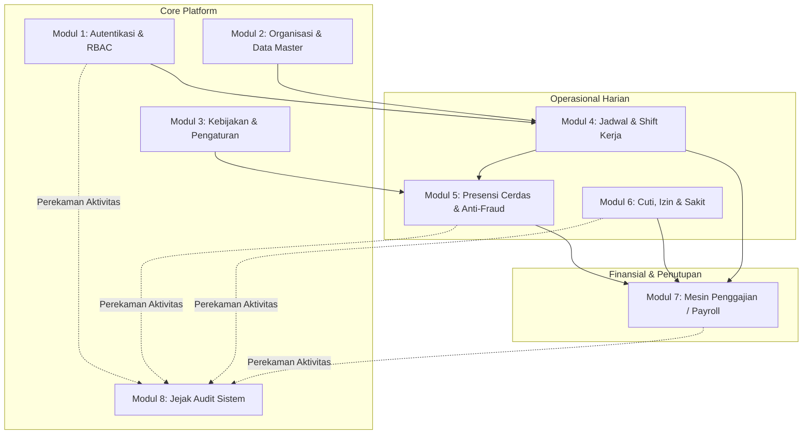
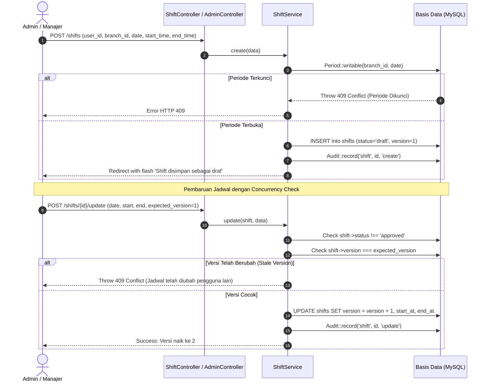
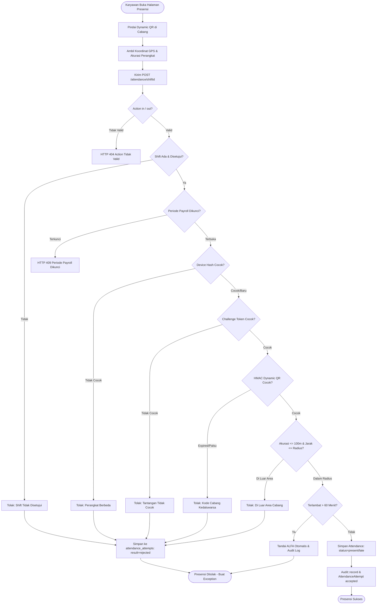
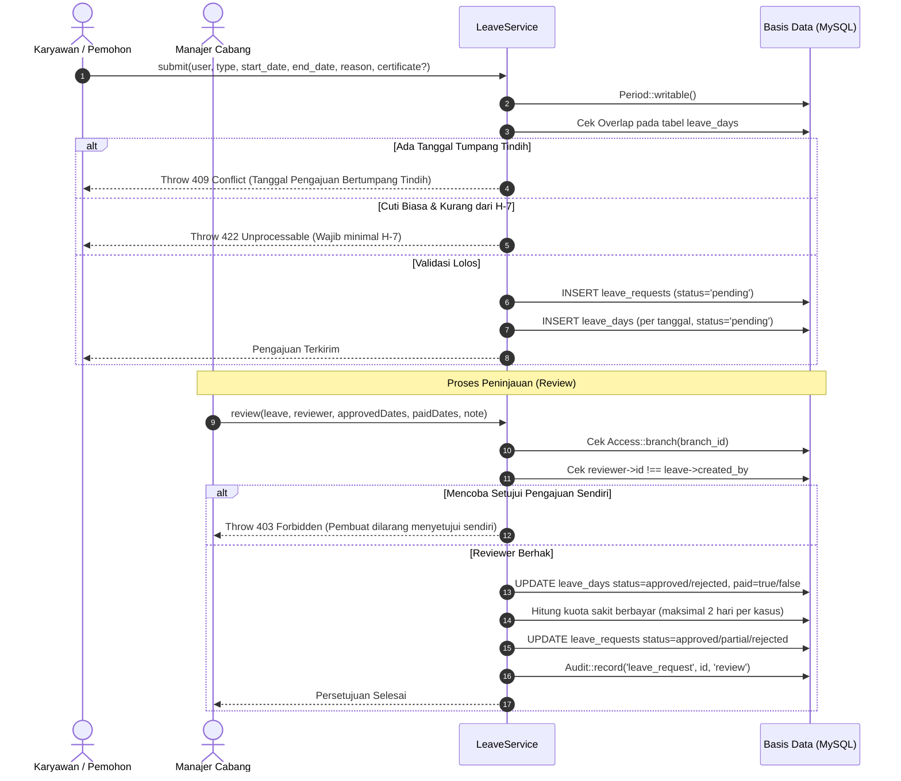
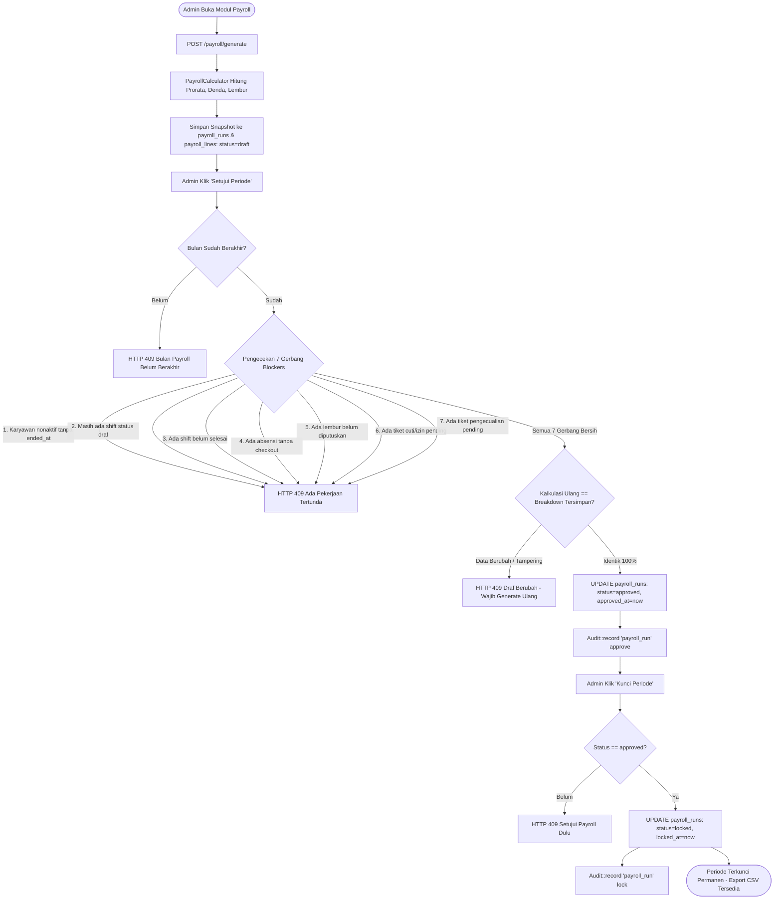

# DOKUMENTASI SISTEM: FITUR, MODUL, ALUR KERJA & AUDIT UJI NEGATIF (NO HAPPY PATH)
## HR Group Management System — HRIS, Attendance & Payroll Platform

---

## 1. Ringkasan Eksekutif & Karakteristik Arsitektur

HR Group Management System adalah platform pengelolaan sumber daya manusia (*Human Resource Information System / HRIS*) multi-cabang yang dirancang untuk industri dinamis (F&B, ritel, operasional multi-outlet). Sistem ini mengintegrasikan penjadwalan kerja (*shift scheduling*), verifikasi presensi berbasis lokasi (*geofencing*) dan kode QR dinamis berputar (*dynamic rolling QR*), manajemen perizinan/cuti/sakit, sistem penggajian (*payroll engine*) berbasis snapshot beku (*immutable snapshot*), serta jejak audit komprehensif (*audit trail*).

### 1.1 Tumpukan Teknologi (Tech Stack)
* **Framework:** Laravel 13.x (PHP 8.4 CLI & Runtime)
* **Basis Data:** MySQL 8.x / MariaDB (Skema relasional modular dengan deklarasi Foreign Key integritas penuh)
* **Frontend:** Laravel Blade Templates, Vanilla CSS terkustomisasi, JavaScript modern (HTML5 Geolocation API, ZXing/Camera QR Scanner)
* **Pola Arsitektur:** *Clean Architecture / Layered Architecture*:
  * **HTTP Request / Routing Layer:** Form Request Validation terisolasi (`app/Http/Requests/*`).
  * **Controller Layer:** *Skinny Controllers* sebagai orkestrator alur HTTP tanpa logika bisnis mentah (`app/Http/Controllers/*`).
  * **Service Layer:** Sentralisasi logika bisnis, aturan transaksi, dan komputasi (`AttendanceService`, `LeaveService`, `PayrollService`, `ShiftService`, `PayrollCalculator`).
  * **Persistence Layer:** Eloquent Models terisolasi dengan relasi formal, mutator, cast, dan query scopes (`app/Models/*`).
  * **Support Layer:** Utilitas kebijakan global, otorisasi peran, kunci periode, dan pencatatan jejak audit (`Access`, `Audit`, `Period`, `Rules`).

---

## 2. Katalog Lengkap Modul & Fitur Sistem



---

### MODUL 1: Autentikasi, Keamanan Sesi & Otorisasi RBAC

Mengatur otentikasi identitas, isolasi batas hak akses, dan kepatuhan sesi.

* **Fitur 1.1: Multi-Role Authentication:**
  * Mendukung 3 tingkatan peran (*role*): `admin` (akses lintas cabang tanpa batas), `manager` (akses terbatas pada cabang tempat ia ditugaskan), dan `employee` (akses mandiri terbatas pada jadwal, absensi, dan pengajuan dirinya sendiri).
* **Fitur 1.2: Boundary Authorization Per Cabang (`Access::branch`):**
  * Memastikan manajer cabang A tidak dapat melihat, mengubah, menyetujui, atau menghapus data karyawan, jadwal, absensi, maupun payroll di cabang B.
* **Fitur 1.3: Boundary Profil & Self-Protection (`Access::employee`):**
  * Karyawan hanya berhak mengakses histori presensi dan riwayat cuti miliknya sendiri. Akses manipulasi via query parameter atau route parameter dicegah dengan HTTP 403 Forbidden.
* **Fitur 1.4: Proteksi Karyawan Nonaktif (`active = false`):**
  * Akun karyawan yang dinonaktifkan (`active = 0`) diblokir dari seluruh proses login dan otentikasi.

---

### MODUL 2: Manajemen Organisasi & Data Master

Mengelola struktur hirarki perusahaan, unit penugasan kerja, dan provisi data karyawan.

* **Fitur 2.1: Manajemen Cabang (*Branches*):**
  * Kode cabang unik (`code`, e.g. `DEMO`, `SBY01`).
  * Nama cabang, titik koordinat geografis (`latitude`, `longitude`), radius toleransi presensi (`radius_m`, e.g. 100m).
  * Kunci rahasia kode QR (`qr_secret`) unik per cabang untuk otentikasi presensi dinamis.
* **Fitur 2.2: Manajemen Jabatan (*Positions*):**
  * Nama jabatan (`name`, e.g. `Super Admin`, `Manager Cabang`, `Staf`, `Kasir`, `Barista`).
* **Fitur 2.3: Manajemen Karyawan (*Users / People*):**
  * Biodata nama, email (unik), relasi ke cabang dan jabatan.
  * Informasi kompensasi: Gaji pokok (`base_salary`).
  * Siklus kerja: Tanggal mulai kerja (`hired_at`) dan tanggal pengakhiran hubungan kerja (`ended_at`).
  * Binding perangkat: Hash unik perangkat pertama (`device_hash`) untuk mencegah absensi titip perangkat.
* **Fitur 2.4: Provisi Data Massal via CSV Import (2-Tahap):**
  * **Tahap 1 (Preview):** Pengunggahan CSV karyawan; sistem memvalidasi header, format tanggal, ketersediaan cabang & jabatan, serta menampilkan pratinjau data valid dan data gagal tanpa menyimpan ke basis data.
  * **Tahap 2 (Commit):** Eksekusi batch transaksional (`DB::transaction`) untuk menyimpan seluruh baris yang lolos validasi ke tabel `users`.

---

### MODUL 3: Konfigurasi Kebijakan Global (*Settings Management*)

Sentralisasi parameter aturan kerja dan formula finansial menggunakan penyimpanan pasangan kunci-nilai (`settings`).

* **Parameter Keterlambatan:**
  * `late_grace_minutes` (Default: 15 menit) — Ambang batas toleransi keterlambatan tanpa denda.
  * `late_unit_minutes` (Default: 15 menit) — Satuan unit kelipatan denda setelah batas toleransi dilewati.
  * `late_penalty_per_unit` (Default: Rp 10.000) — Besaran potongan per unit keterlambatan.
  * `late_reject_minutes` (Default: 60 menit) — Batas keterlambatan maksimal sebelum sistem otomatis menolak check-in dan menandai absensi sebagai `absent` (alfa).
* **Parameter Jendela Presensi:**
  * `checkin_early_minutes` (Default: 60 menit) — Batas paling awal karyawan diizinkan check-in sebelum jam mulai shift.
  * `checkout_late_hours` (Default: 6 jam) — Batas maksimal karyawan diizinkan check-out setelah jam selesai shift.
* **Parameter Lembur & Perizinan:**
  * `overtime_threshold_minutes` (Default: 90 menit) — Ambang batas kelebihan menit kerja setelah jam shift selesai sebelum mulai dihitung sebagai lembur berbayar.
  * `leave_notice_days` (Default: 7 hari) — Batas minimal H-X pengajuan cuti/izin biasa.
  * `sick_paid_days_per_case` (Default: 2 hari) — Kuota hari sakit berbayar per kasus pengajuan medis.
* **Parameter Formula Prorata:**
  * `daily_divisor` (`calendar` atau `fixed_30`) — Pembagi hari kerja untuk tarif gaji harian.
  * `hourly_divisor` (Default: 24 jam) — Pembagi tarif gaji per jam dari nilai harian.

---

### MODUL 4: Manajemen Jadwal & Shift Kerja (*Shift Scheduling*)

Mengatur perencanaan shift operasional karyawan dengan kontrol konkurensi optimistik.

* **Fitur 4.1: Penjadwalan Shift Kerja:**
  * Penugasan karyawan (`user_id`), cabang (`branch_id`), jam mulai (`start_at`), dan jam selesai (`end_at`).
  * Penanganan otomatis shift melewati tengah malam (*cross-midnight shift*): jika jam selesai $\le$ jam mulai, sistem otomatis menambahkan 1 hari pada `end_at`.
* **Fitur 4.2: Optimistic Locking & Concurrency Control:**
  * Setiap baris shift memiliki kolom `version` (dimulai dari `1`).
  * Saat pembaruan jadwal dilakukan, Controller/Service memverifikasi `expected_version === shift->version`. Jika ada manajer lain yang telah mengubah shift tersebut terlebih dahulu, pembaruan kedua otomatis ditolak dengan pesan konflik HTTP 409.
* **Fitur 4.3: Siklus Persetujuan Shift (*Shift Lifecycle*):**
  * Status awal adalah `draft`.
  * Shift draf harus disetujui (`status = approved`) oleh manajer atau admin sebelum karyawan dapat melakukan absensi pada shift tersebut.
  * Shift yang telah disetujui dilarang diedit langsung tanpa pembatalan/mekanisme khusus.
* **Fitur 4.4: Proteksi Periode Terkunci (`Period::writable`):**
  * Pembuatan atau pembaruan shift pada bulan yang telah disetujui atau dikunci oleh proses payroll ditolak seketika (HTTP 409).

---

### MODUL 5: Presensi Cerdas & Anti-Fraud (*Smart Attendance*)

Mesin verifikasi presensi berlapis untuk menjamin keaslian kehadiran fisik karyawan.

* **Fitur 5.1: Dynamic Rolling QR Code:**
  * Token QR di-generate menggunakan algoritma `HMAC-SHA256(branch_id | time_slot, qr_secret)` dengan slot waktu setiap 30 detik.
  * Mencegah pemotretan QR statis atau pembagian gambar QR ke grup pesan.
* **Fitur 5.2: Verifikasi Geofencing (Formula Haversine):**
  * Menghitung jarak lengkung bumi sesungguhnya antara koordinat GPS perangkat karyawan dan titik pusat cabang.
  * Memverifikasi akurasi GPS: jika `accuracy_m > 100` atau `distance + accuracy > branch->radius_m`, check-in ditolak.
* **Fitur 5.3: Device Binding (Anti-Titip Absen):**
  * Perangkat karyawan diikat melalui hash token unik (`device_hash`). Percobaan absensi menggunakan akun yang sama dari smartphone berbeda langsung diblokir.
* **Fitur 5.4: Attendance Challenge (Anti-Replay Token):**
  * Setiap request form absensi menghasilkan token tantangan sesi sekali pakai (`attendance_challenge`) yang langsung dihancurkan setelah eksekusi.
* **Fitur 5.5: Log Percobaan Presensi Komprehensif (`attendance_attempts`):**
  * Merekam setiap percobaan presensi, baik yang berstatus `accepted` maupun `rejected`.
  * Mencatat koordinat, akurasi, jarak hitung, IP address, device match, dan alasan penolakan untuk audit forensik.
* **Fitur 5.6: Pengajuan & Review Pengecualian Presensi (`attendance_exceptions`):**
  * Memfasilitasi karyawan yang mengalami kendala teknis (GPS error, kamera rusak) untuk mengajukan tiket koreksi dengan alasan dan bukti.
  * Manajer berhak menyetujui (`approved`) atau menolak (`rejected`) tiket pengecualian tersebut.
* **Fitur 5.7: Persetujuan Lembur (*Overtime Decision*):**
  * Menit kelebihan kerja di atas ambang batas (`overtime_threshold_minutes`) tidak otomatis dibayarkan, melainkan harus ditinjau dan disetujui secara eksplisit oleh manajer (`overtime_approved_by`).

---

### MODUL 6: Manajemen Pengajuan Cuti, Izin & Sakit (*Leave Management*)

Mengatur permohonan ketidakhadiran berbayar maupun tidak berbayar.

* **Fitur 6.1: Multi-Day Date Splitting:**
  * Permohonan dengan rentang tanggal (`start_date` sampai `end_date`) secara otomatis dipecah menjadi entri harian atomik di tabel `leave_days`.
* **Fitur 6.2: Verifikasi Batas Waktu Pemberitahuan (Notice Period):**
  * Cuti biasa (`leave`) wajib diajukan minimal H-7 (`leave_notice_days`) sebelum tanggal pelaksanaan.
* **Fitur 6.3: Bukti Surat Keterangan Sakit Medis:**
  * Pengajuan sakit (`sick`) wajib mengunggah dokumen bukti/surat dokter yang disimpan secara aman di storage lokal (`storage/app/certificates`).
* **Fitur 6.4: Proteksi Anti-Overlap:**
  * Sistem menolak pengajuan jika salah satu tanggal dalam rentang tersebut sudah memiliki permohonan lain yang berstatus `pending` atau `approved`.
* **Fitur 6.5: Proteksi Approval Sendiri (*Self-Approval Prevention*):**
  * Manajer dilarang keras menyetujui pengajuan izin/cuti yang dibuat oleh dirinya sendiri (`created_by === reviewer->id`).
* **Fitur 6.6: Persetujuan Parsial & Penetapan Hak Bayar:**
  * Manajer dapat menyetujui sebagian tanggal (`partial`), menolak seluruhnya (`rejected`), atau menyetujui semuanya (`approved`).
  * Aturan kuota otomatis: Untuk tipe sakit, hari yang disetujui berbayar dibatasi maksimal `sick_paid_days_per_case` (default 2 hari); selebihnya otomatis menjadi tidak berbayar (*unpaid*).

---

### MODUL 7: Mesin Penggajian & Payroll Engine (*Payroll & Financial Snapshot*)

Komputasi gaji otomatis, penegakan integritas data, dan penyimpanan snapshot permanen.

* **Fitur 7.1: Gerbang Integritas 7-Pintu (*7-Gate Blockers Verification*):**
  * Draf payroll pada suatu cabang dan bulan tertentu **TIDAK DAPAT DISETUJUI** selama masih ada salah satu dari 7 kondisi berikut:
    1. Ada karyawan non-aktif tanpa tanggal akhir kerja (`ended_at IS NULL`).
    2. Ada shift yang masih berstatus `draft`.
    3. Ada shift yang belum selesai (jam akhir masih di masa depan).
    4. Ada absensi yang sudah check-in namun belum check-out.
    5. Ada kelebihan jam kerja (lembur) yang belum disetujui/ditolak.
    6. Ada pengajuan cuti/izin/sakit yang masih berstatus `pending`.
    7. Ada tiket pengecualian presensi yang masih berstatus `pending`.
* **Fitur 7.2: Formula Prorata Hari Kalender:**
  $$\text{Hari Aktif} = \text{diffInDays}(\max(\text{hired\_at}, \text{awal\_bulan}), \min(\text{ended\_at}, \text{akhir\_bulan})) + 1$$
  $$\text{Daily Rate} = \frac{\text{base\_salary}}{\text{daily\_divisor}}$$
  $$\text{Prorated Base} = \text{Daily Rate} \times \text{Hari Aktif}$$
* **Fitur 7.3: Komponen Potongan & Penambahan:**
  * **Potongan Hari Tidak Berbayar (*Unpaid Deduction*):** Total hari cuti tidak berbayar dan hari shift tanpa absensi/alfa $\times \text{Daily Rate}$.
  * **Potongan Keterlambatan (*Late Deduction*):** Total unit keterlambatan $\times \text{late\_penalty\_per\_unit}$.
  * **Kompensasi Lembur (*Overtime Pay*):** $\frac{\text{Hourly Rate} \times \text{Menit Lembur Disetujui}}{60}$.
  * **Koreksi Manual (*Adjustments*):** Nominal penyesuaian manual (bonus/klaim/potongan khusus) dari tabel `payroll_adjustments`.
  * **Gaji Bersih (*Net Pay*):** $\text{Prorated Base} - \text{Unpaid} - \text{Late} + \text{Overtime} + \text{Manual}$.
* **Fitur 7.4: Frozen Snapshot Immutability:**
  * Setelah payroll disetujui, seluruh rincian JSON *breakdown* dan nilai nominal *net* dibekukan di `payroll_lines`. Perubahan gaji pokok atau formula di masa depan tidak akan merusak historis data finansial yang telah dibayarkan.
* **Fitur 7.5: Deteksi Perubahan Data Draf (*Draft Drift Detection*):**
  * Saat manajer/admin menekan tombol setujui (*approve*), sistem secara otomatis mengkalkulasi ulang seluruh data. Jika ada data presensi/shift yang berubah sejak draf dibuat, persetujuan digagalkan dan pengguna diwajibkan membuat ulang draf (*regenerate draft*).
* **Fitur 7.6: Penguncian Periode (*Payroll Lock*):**
  * Periode yang telah disetujui dapat dikunci permanen (`status = locked`). Setelah dikunci, seluruh modul jadwal, absensi, koreksi, dan izin pada bulan tersebut disegel rapat dari perubahan apa pun.
* **Fitur 7.7: Ekspor CSV Aman Formula Injection (`safeCsv`):**
  * Mengamankan sel CSV dari serangan formula injection (*CSV injection*) dengan menambahkan prefiks tanda kutip (`'`) pada data yang diawali karakter `=`, `+`, `-`, atau `@`.

---

### MODUL 8: Jejak Audit Sistem (*Audit Trail*)

Pencatatan rekam jejak forensik untuk seluruh mutasi data sensitif di tabel `audit_logs`.

* **Fitur 8.1: Perekaman Metadata Lengkap:**
  * Menyimpan ID pelaku (`actor_id`), tipe entitas (`subject_type`), ID entitas (`subject_id`), aksi (`action`), alasan (`reason`), snapshot sebelum mutasi (`before`), snapshot sesudah mutasi (`after`), IP address klien (`ip`), dan timestamp mutasi.
* **Fitur 8.2: Cakupan Entitas:**
  * Shift (create, update, approve).
  * Absensi (checkin, checkout, auto_absent, correction, overtime_approve).
  * Pengecualian Absensi (create, approved, rejected).
  * Pengajuan Cuti (submit, review).
  * Payroll Run (generate, approve, lock).
  * Koreksi Payroll Manual (create).

---

## 3. Diagram Alur Kerja Sistem (End-to-End Flowcharts)

### Alur 1: Penjadwalan Shift & Optimistic Locking Concurrency



---

### Alur 2: Presensi Cerdas (Geofencing, Dynamic QR & Anti-Fraud)



---

### Alur 3: Pengajuan & Review Cuti / Sakit Berjenjang



---

### Alur 4: Penggajian (7-Gate Validation, Draf, Review, Approval & Locking)



---

## 4. Audit & Desain Matriks Pengujian Negatif (NO HAPPY PATH)

Filosofi pengujian **"No Happy Path"** berfokus pada pembuktian ketangguhan sistem saat dieksploitasi oleh input tidak valid, anomali waktu, pelanggaran integritas, serangan injeksi, serta upaya pembobolan otorisasi.

Berikut adalah matriks pengujian negatif lengkap per modul:

### Domain A: Autentikasi, Sesi & Otorisasi RBAC

| ID Uji | Modul / Titik Masuk | Skenario Ekstrem (No Happy Path) | Input / Kondisi Uji | Ekspektasi Respon / Exception | Validasi Keadaan Basis Data |
| :--- | :--- | :--- | :--- | :--- | :--- |
| **AUTH-NEG-01** | `POST /login` | Kredensial salah total | Email terdaftar, password salah acak | HTTP 302 Redirect + Session Error `email` | Sesi tidak terotentikasi |
| **AUTH-NEG-02** | `POST /login` | Email format rusak / injeksi | `email = "' OR '1'='1"`, password acak | HTTP 302 Validation Error (Invalid email) | Tidak ada bypass login |
| **AUTH-NEG-03** | `POST /login` | Login karyawan nonaktif | Karyawan dengan `active = 0` | HTTP 302 Session Error "Akun nonaktif" | Sesi ditolak |
| **AUTH-NEG-04** | `GET /people` | Akses Admin oleh Employee | Autentikasi sebagai role `employee` | HTTP 403 Forbidden | Tidak ada data karyawan bocor |
| **AUTH-NEG-05** | `GET /payroll` | Akses Payroll oleh Manager | Autentikasi sebagai role `manager` | HTTP 403 Forbidden | Modul payroll disegel dari manajer |
| **AUTH-NEG-06** | `GET /settings` | Akses Settings oleh Employee | Autentikasi sebagai role `employee` | HTTP 403 Forbidden | Konfigurasi sistem aman |
| **AUTH-NEG-07** | `POST /branches` | Pembuatan Cabang oleh Manager | Autentikasi sebagai role `manager` | HTTP 403 Forbidden | Data cabang tidak termutasi |
| **AUTH-NEG-08** | Lintas Cabang | Manajer A review izin Cabang B | Manajer Cabang A menyetujui izin Cabang B | HTTP 403 Forbidden (`Access::branch`) | Status izin di Cabang B tetap `pending` |
| **AUTH-NEG-09** | Tampering ID | Karyawan intip izin orang lain | Karyawan A mengakses sertifikat Karyawan B | HTTP 403 Forbidden (`Access::employee`) | Dokumen medis tidak terunduh |

---

### Domain B: Master Data, Cabang & CSV Import

| ID Uji | Modul / Titik Masuk | Skenario Ekstrem (No Happy Path) | Input / Kondisi Uji | Ekspektasi Respon / Exception | Validasi Keadaan Basis Data |
| :--- | :--- | :--- | :--- | :--- | :--- |
| **MST-NEG-01** | `POST /branches` | Kode cabang duplikat | `code = 'DEMO'` (sudah ada di DB) | HTTP 302 Validation Error `code` unique | Tidak ada baris cabang baru |
| **MST-NEG-02** | `POST /branches` | Radius nol atau negatif | `radius_m = -50` atau `radius_m = 0` | HTTP 302 Validation Error `radius_m` min:10 | Data tidak disimpan |
| **MST-NEG-03** | `POST /branches` | Koordinat GPS di luar bumi | `latitude = 150.0`, `longitude = -200.0` | HTTP 302 Validation Error boundary | Data tidak disimpan |
| **MST-NEG-04** | `POST /people` | Email karyawan duplikat | Email sudah terdaftar pada user lain | HTTP 302 Validation Error `email` unique | User tidak terbuat |
| **MST-NEG-05** | `POST /people` | Gaji pokok bernilai negatif | `base_salary = -5000000` | HTTP 302 Validation Error `base_salary` min:0 | User tidak terbuat |
| **MST-NEG-06** | `POST /people` | Tanggal selesai mendahului mulai | `hired_at = 2026-09-10`, `ended_at = 2026-09-01` | HTTP 302 Validation Error `ended_at` after:hired_at | User tidak terbuat |
| **MST-NEG-07** | `POST /people` | Referensi Cabang/Jabatan hantu | `branch_id = 99999` (ID fiktif) | HTTP 302 Validation Error `exists:branches,id` | Foreign Key integrity terjaga |
| **MST-NEG-08** | `POST /import/preview` | File non-CSV (eksekusi binary) | Mengunggah file `.php` atau `.sh` | HTTP 302 Validation Error mime:csv,txt | File tidak dieksekusi di server |
| **MST-NEG-09** | `POST /import/commit` | Commit data dengan baris invalid | Baris CSV mengandung email duplikat | Validasi per baris gagal, baris ditolak | DB rollback bersih |

---

### Domain C: Penjadwalan Shift & Concurrency Control

| ID Uji | Modul / Titik Masuk | Skenario Ekstrem (No Happy Path) | Input / Kondisi Uji | Ekspektasi Respon / Exception | Validasi Keadaan Basis Data |
| :--- | :--- | :--- | :--- | :--- | :--- |
| **SFT-NEG-01** | `POST /shifts` | Buat shift di bulan terkunci | Tanggal berada pada bulan berstatus `locked` | HTTP 409 Conflict (`Period::writable`) | Tidak ada shift baru |
| **SFT-NEG-02** | `POST /shifts/{id}/update` | Edit shift yang sudah disetujui | Shift berstatus `status = 'approved'` | HTTP 409 Conflict ("Shift sudah disetujui") | Jadwal tidak berubah |
| **SFT-NEG-03** | `POST /shifts/{id}/update` | Concurrency race condition | Dua admin edit bersamaan, `expected_version = 1` | Permintaan ke-2 lempar HTTP 409 Conflict | Versi tetap bertambah teratur |
| **SFT-NEG-04** | `POST /shifts/{id}/approve` | Karyawan approve shift sendiri | Autentikasi sebagai role `employee` | HTTP 403 Forbidden | Status shift tetap `draft` |
| **SFT-NEG-05** | `POST /shifts` | Shift untuk user non-aktif | `user_id` mengarah ke user `active = 0` | Validasi rejected / peringatan | Jadwal tidak terbit |

---

### Domain D: Presensi, Dynamic QR, Geofencing & Anti-Fraud

| ID Uji | Modul / Titik Masuk | Skenario Ekstrem (No Happy Path) | Input / Kondisi Uji | Ekspektasi Respon / Exception | Validasi Keadaan Basis Data |
| :--- | :--- | :--- | :--- | :--- | :--- |
| **ATT-NEG-01** | `POST /attendance/{id}` | Check-in pada shift status draf | Shift berstatus `status = 'draft'` | Throw ValidationException ("Shift tidak disetujui") | `attendance_attempts` catat `rejected` |
| **ATT-NEG-02** | `POST /attendance/{id}` | Check-in ganda (Double check-in) | Check-in ke-2 pada shift yang sudah in | Throw ValidationException ("Check-in sudah tercatat") | Tidak ada duplikasi record |
| **ATT-NEG-03** | `POST /attendance/{id}` | Check-out tanpa pernah check-in | Langsung request `action = 'out'` | Throw ValidationException ("Check-out tidak sah") | `attendances` tetap kosong |
| **ATT-NEG-04** | `POST /attendance/{id}` | Check-out ganda | Request `action = 'out'` setelah checkout | Throw ValidationException ("Check-out tidak sah/ganda")| `checkout_at` asli tidak tertimpa |
| **ATT-NEG-05** | `POST /attendance/{id}` | Check-in terlalu awal | Waktu saat ini > 60 menit sebelum shift | Throw ValidationException ("Terlalu awal") | Percobaan ditolak |
| **ATT-NEG-06** | `POST /attendance/{id}` | Check-in setelah shift selesai | Waktu saat ini melewati `end_at` | Throw ValidationException ("Shift telah selesai") | Percobaan ditolak |
| **ATT-NEG-07** | `POST /attendance/{id}` | Terlambat ekstrim (> 60 menit) | Check-in terlambat 65 menit | Otomatis tandai ALFA (`status = absent`) | `attendances.status = absent`, denda dihitung |
| **ATT-NEG-08** | `POST /attendance/{id}` | QR Code kadaluarsa / rotasi slot | Mengirim kode slot menit sebelumnya | Throw ValidationException ("Kode cabang kedaluwarsa") | Percobaan ditolak |
| **ATT-NEG-09** | `POST /attendance/{id}` | QR Code cabang lain | QR cabang Surabaya dipakai di Jakarta | Throw ValidationException ("Kode cabang kedaluwarsa") | Percobaan ditolak |
| **ATT-NEG-10** | `POST /attendance/{id}` | Titip absen beda perangkat | `deviceToken` berbeda dari `device_hash` | Throw ValidationException ("Perangkat berbeda") | Akun terproteksi dari titip absen |
| **ATT-NEG-11** | `POST /attendance/{id}` | Challenge replay attack | Token `attendance_challenge` dipakai 2x | Throw ValidationException ("Tantangan tidak cocok") | Serangan replay gagal |
| **ATT-NEG-12** | `POST /attendance/{id}` | Lokasi GPS di luar radius | Jarak hitung 350m (radius cabang 100m) | Throw ValidationException ("Di luar area") | Percobaan tercatat di log attempt |
| **ATT-NEG-13** | `POST /attendance/{id}` | GPS akurasi rendah (> 100m) | Nilai `accuracy = 150` | Throw ValidationException ("Akurasi GPS rendah") | Presensi ditolak |
| **ATT-NEG-14** | `POST /attendance/{id}` | Check-in pada periode terkunci | Tanggal shift pada bulan yang locked | HTTP 409 Conflict (`Period::writable`) | Tidak ada mutasi presensi |

---

### Domain E: Pengecualian Absensi, Koreksi & Lembur

| ID Uji | Modul / Titik Masuk | Skenario Ekstrem (No Happy Path) | Input / Kondisi Uji | Ekspektasi Respon / Exception | Validasi Keadaan Basis Data |
| :--- | :--- | :--- | :--- | :--- | :--- |
| **EXC-NEG-01** | `POST .../exception` | Pengecualian pada shift orang lain | Karyawan A submit exception untuk Shift B | HTTP 403 Forbidden | Tiket tidak tersimpan |
| **EXC-NEG-02** | `POST .../exceptions/{id}` | Review tiket yang sudah diputus | Tiket berstatus `approved`, direview lagi | HTTP 409 Conflict | Keputusan awal tidak tertimpa |
| **EXC-NEG-03** | `POST .../exceptions/{id}` | Review oleh manajer cabang lain | Manajer cabang lain mencoba mereview | HTTP 403 Forbidden (`Access::branch`) | Status tiket tetap `pending` |
| **COR-NEG-01** | `POST .../correct` | Koreksi pada bulan payroll locked | Mengoreksi absensi pada bulan terkunci | HTTP 409 Conflict (`Period::writable`) | Data absensi tidak termutasi |
| **OVT-NEG-01** | `POST .../overtime` | Approve lembur tanpa checkout | Absensi belum memiliki `checkout_at` | HTTP 409 Conflict | `overtime_approved_by` tetap NULL |
| **OVT-NEG-02** | `POST .../overtime` | Approve lembur pada menit $\le 0$ | Absensi dengan `overtime_minutes = 0` | HTTP 409 Conflict | Kompensasi lembur tidak terbit |

---

### Domain F: Pengajuan Cuti, Izin & Sakit

| ID Uji | Modul / Titik Masuk | Skenario Ekstrem (No Happy Path) | Input / Kondisi Uji | Ekspektasi Respon / Exception | Validasi Keadaan Basis Data |
| :--- | :--- | :--- | :--- | :--- | :--- |
| **LEV-NEG-01** | `POST /leave` | Izin mendadak (< H-7) | Tipe `leave`, tanggal H+2 dari sekarang | HTTP 302 Validation Error ("Minimal H-7") | Pengajuan ditolak |
| **LEV-NEG-02** | `POST /leave` | Sakit tanpa melampirkan surat | Tipe `sick`, berkas `certificate` kosong | HTTP 302 Validation Error ("Wajib surat sakit") | Pengajuan ditolak |
| **LEV-NEG-03** | `POST /leave` | Upload file berbahaya | Mengunggah file `virus.sh` sebagai surat | HTTP 302 Validation Error (Mimes: pdf, jpg) | File ditolak |
| **LEV-NEG-04** | `POST /leave` | Tanggal selesai mendahului mulai | `start_date = 2026-09-25`, `end_date = 2026-09-20` | HTTP 302 Validation Error after_or_equal | Pengajuan ditolak |
| **LEV-NEG-05** | `POST /leave` | Tumpang tindih tanggal (*Overlap*) | Mengajukan tanggal yang sudah diajukan | HTTP 409 Conflict ("Bertumpang tindih") | Baris `leave_days` tidak menduplikasi |
| **LEV-NEG-06** | `POST /leave/{id}/review` | Self-Approval oleh Manajer | Manajer menyetujui tiket buatannya sendiri | HTTP 403 Forbidden ("Dilarang setujui sendiri") | Status tetap `pending` |
| **LEV-NEG-07** | `POST /leave/{id}/review` | Tanggal persetujuan fiktif | Array `approved_dates` memuat tanggal luar | HTTP 422 Unprocessable ("Tanggal tidak valid") | Data tidak termutasi |
| **LEV-NEG-08** | `POST /leave/{id}/review` | Review tiket yang sudah diputus | Status tiket sudah `approved` | HTTP 409 Conflict | Keputusan awal terkunci |

---

### Domain G: Mesin Penggajian (7-Gate Blockers, Drift & Lockout)

| ID Uji | Modul / Titik Masuk | Skenario Ekstrem (No Happy Path) | Input / Kondisi Uji | Ekspektasi Respon / Exception | Validasi Keadaan Basis Data |
| :--- | :--- | :--- | :--- | :--- | :--- |
| **PAY-NEG-01** | `POST /payroll/generate` | Generate pada periode yang locked | Run sudah berstatus `locked` | HTTP 409 Conflict ("Periode sudah disetujui") | Snapshot tidak terhapus |
| **PAY-NEG-02** | `POST /payroll/approve` | Approve sebelum bulan berakhir | Menyetujui bulan berjalan (hari ini < akhir bln) | HTTP 409 Conflict ("Bulan belum berakhir") | Status tetap `draft` |
| **PAY-NEG-03** | `POST /payroll/approve` | Gate 1: Karyawan nonaktif tanpa tgl | Ada karyawan `active=0` dengan `ended_at=null` | HTTP 409 Conflict ("Karyawan nonaktif tanpa tgl") | Persetujuan diblokir |
| **PAY-NEG-04** | `POST /payroll/approve` | Gate 2: Masih ada shift draf | Ada shift `status = 'draft'` pada bulan uji | HTTP 409 Conflict ("Shift draf") | Persetujuan diblokir |
| **PAY-NEG-05** | `POST /payroll/approve` | Gate 3: Shift belum selesai | Ada shift yang `end_at > now` | HTTP 409 Conflict ("Shift belum selesai") | Persetujuan diblokir |
| **PAY-NEG-06** | `POST /payroll/approve` | Gate 4: Absensi menggantung | Ada absensi dengan `checkout_at IS NULL` | HTTP 409 Conflict ("Absensi belum check-out") | Persetujuan diblokir |
| **PAY-NEG-07** | `POST /payroll/approve` | Gate 5: Lembur belum diputus | Ada absensi `overtime_minutes > 0`, blm di-acc | HTTP 409 Conflict ("Lembur belum diputuskan") | Persetujuan diblokir |
| **PAY-NEG-08** | `POST /payroll/approve` | Gate 6: Pengajuan izin pending | Ada `leave_requests` berstatus `pending` | HTTP 409 Conflict ("Pengajuan tertunda") | Persetujuan diblokir |
| **PAY-NEG-09** | `POST /payroll/approve` | Gate 7: Pengecualian absensi pending | Ada `attendance_exceptions` berstatus `pending` | HTTP 409 Conflict ("Pengecualian tertunda") | Persetujuan diblokir |
| **PAY-NEG-10** | `POST /payroll/approve` | Data Draf Mengalami Drift | Shift diubah manual setelah draf dibuat | HTTP 409 Conflict ("Draf payroll berubah") | Status tetap `draft` |
| **PAY-NEG-11** | `POST /payroll/lock` | Kunci run yang belum diapprove | Mengunci run yang masih berstatus `draft` | HTTP 409 Conflict ("Setujui payroll dulu") | Status tidak menjadi locked |
| **PAY-NEG-12** | `POST /payroll/adjustment` | Tambah koreksi pada bulan approved | Run pada cabang tersebut sudah `approved` | HTTP 409 Conflict ("Periode telah disetujui") | Koreksi manual ditolak |
| **PAY-NEG-13** | `GET /payroll/export` | Ekspor CSV pada draf belum acc | Status run masih `draft` | HTTP 409 Conflict | CSV tidak diterbitkan |
| **PAY-NEG-14** | `GET /payroll/export` | Serangan CSV Formula Injection | Nama karyawan diawali `=cmd|' /C calc'!A0` | Nilai di-escape dengan tanda kutip `'=` | Spreadsheet aman saat dibuka |

---

## 5. Audit Kesiapan Infrastruktur Pengujian (Test Tooling Audit)

### 5.1 Temuan Audit Lingkungan Pengujian
1. **Runner Pengujian Bawaan Laravel (`php artisan test`):**
   * Saat ini, dependensi `phpunit/phpunit` atau `pestphp/pest` belum tercantum pada bagian `require-dev` di `composer.json`.
   * Akibatnya, perintah `php artisan test` atau `./vendor/bin/phpunit` belum dapat dieksekusi secara native.
2. **Skrip Verifikasi Mandiri Terintegrasi (`scripts/`):**
   * Proyek saat ini memiliki 2 skrip pengujian berbasis CLI yang mengeksekusi kernel Laravel secara langsung:
     * `scripts/verify-business.php` (Pengujian unit formula kalkulator, batas keterlambatan, prorata kalender).
     * `scripts/verify-services.php` (Pengujian integrasi transaksional 6 modul backend dan seluruh service layer).
3. **Konfigurasi Lingkungan Pengujian (`phpunit.xml`):**
   * Berkas `phpunit.xml` sudah terkonfigurasi dengan database testing SQLite in-memory (`:memory:`).
   * Migrasi modular yang telah dibangun sebelumnya telah siap dijalankan di lingkungan SQLite maupun MySQL.

### 5.2 Rekomendasi Langkah Teknis Selanjutnya
Untuk mengimplementasikan seluruh matriks pengujian negatif di atas:
1. Menambahkan paket pengujian resmi via Composer:
   ```bash
   composer require --dev phpunit/phpunit
   ```
2. Mengembangkan suite pengujian terstruktur:
   * **Unit Tests (`tests/Unit/*`):** Menguji formula matematika murni, pembagian hari kerja, perhitungan batas menit terlambat (`Rules::lateUnits`), kalkulasi jarak geofencing Haversine, dan sanitasi CSV.
   * **Feature / Integration Tests (`tests/Feature/*`):** Menguji rute HTTP, penegakan form request validation, penolakan hak akses peran (403), konflik konkurensi (409), gerbang 7-pintu payroll, dan siklus transaksi multi-tabel dengan *database rollback*.

---

*Dokumen ini merupakan acuan spesifikasi resmi untuk fitur, modul, alur kerja, dan pengujian keandalan sistem HR Group.*
