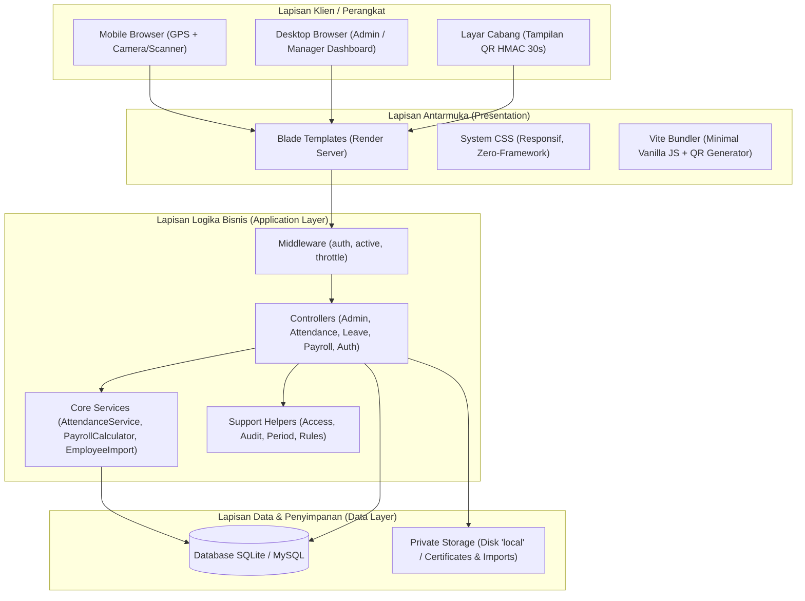
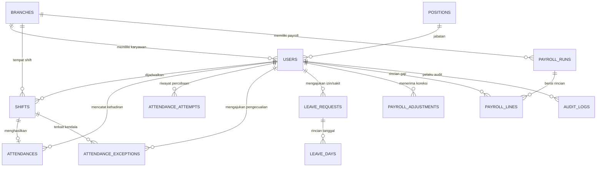
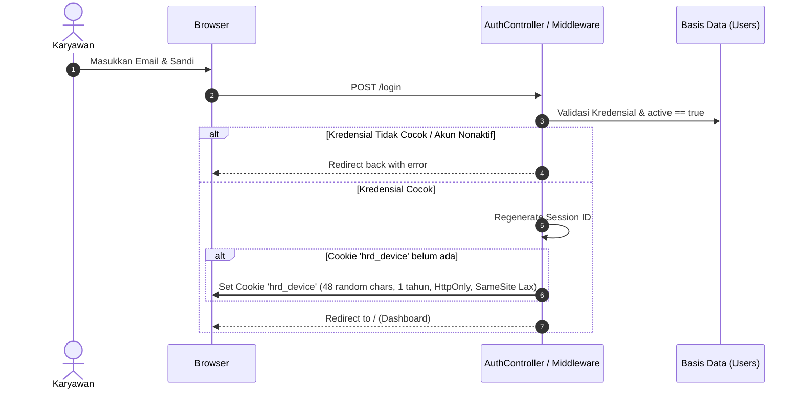
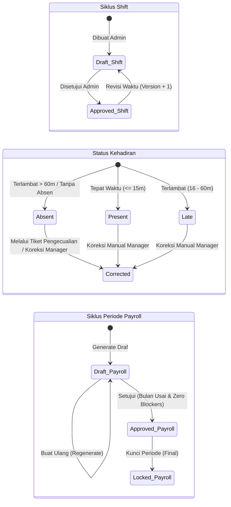

# Dokumen Spesifikasi & Rancangan Sistem (System Design Document)
## HR Group — Human Resource, Attendance, & Payroll System (MVP)

---

| Atribut Dokumen | Informasi |
| :--- | :--- |
| **Nama Sistem** | HR Group Browser MVP |
| **Repositori Sumber** | [`hrghrd`](file:///Users/lrmcorporation/Documents/Website/hrghrd) |
| **Versi Dokumen** | 1.0.0 (Baseline Spesifikasi) |
| **Status** | Disetujui sebagai Acuan Arsitektur & Fungsional |
| **Target Lingkungan** | Web Browser (Desktop & Mobile LAN/HTTPS) |
| **Zona Waktu Standar** | `Asia/Jakarta` (WIB / UTC+7) |

---

## 1. Pendahuluan & Batasan Sistem

### 1.1 Gambaran Umum Produk
**HR Group MVP** adalah sistem informasi manajemen sumber daya manusia (HRIS) berbasis web monolitik yang dirancang untuk mengelola siklus operasional harian: administrasi karyawan, penjadwalan shift kerja multi-cabang, pencatatan presensi kehadiran dengan mitigasi kecurangan (*anti-fraud*), perizinan & sakit berbasis bukti medis, hingga kalkulasi payroll otomatis dengan perhitungan prorata, potongan denda, dan lembur.

### 1.2 Sasaran & Tujuan Bisnis
1. **Pencegahan Kecurangan Presensi (*Zero Fraud Attendance*):** Mengeliminasi joki absensi dan pemalsuan lokasi (*fake GPS*) melalui kombinasi *Geofencing*, *Device Binding* berbasis perangkat fisik, *Time-based HMAC QR Code*, dan *Interactive Challenge*.
2. **Akuntabilitas & Jejak Audit Lengkap:** Menghilangkan perubahan data sepihak melalui alur persetujuan bertahap (*staged approval*) dan pencatatan riwayat perubahan (*audit trail*) di setiap modul kritis.
3. **Automasi Penggajian yang Adil & Presisi:** Memastikan kalkulasi gaji bersih (*net pay*) transparan dengan pemisahan draf, peninjauan *blocker*, perhitungan prorata masa kerja, dan penguncian periode.

### 1.3 Batasan Sistem (Scope & Limitations)
*   **Termasuk dalam Sistem (In-Scope):**
    *   Manajemen cabang, posisi/jabatan, dan akun karyawan berbasis 3 tingkat peran.
    *   Parser mandiri impor data karyawan via CSV dan XLSX (tanpa dependensi eksternal).
    *   Penyusunan jadwal shift dengan penanganan otomatis shift lintas tengah malam.
    *   Validasi presensi multi-faktor (QR HMAC dinamis 30 detik, GPS Haversine, Device Cookie Hash).
    *   Alur pengajuan pengecualian absensi (*attendance exception*) dan koreksi data kehadiran.
    *   Pengajuan izin biasa (minimal H-7) dan sakit berbayar (maksimal 2 hari per kejadian) dengan penyimpanan bukti medis privat.
    *   Mesin penggajian (*payroll engine*) dengan kalkulasi prorata, denda keterlambatan per 15 menit, lembur di atas 90 menit, penyesuaian manual, dan ekspor CSV aman (*anti-CSV injection*).
*   **Di Luar Batasan Sistem (Out-of-Scope / Batasan MVP):**
    *   Perhitungan pajak penghasilan resmi (PPh 21 skema TER / tarif progresif).
    *   Pemotongan iuran BPJS Ketenagakerjaan (JHT, JKK, JKM, JP) dan BPJS Kesehatan.
    *   Manajemen kuota/saldo cuti tahunan (*annual leave balance accrual*).
    *   Integrasi gateway perbankan (*corporate disbursment / bulk payment API*).
    *   Pengiriman notifikasi eksternal (Email SMTP / WhatsApp Gateway).
    *   Aplikasi seluler native (Flutter disiapkan pada fase berikutnya).

---

## 2. Arsitektur Sistem & Infrastruktur

### 2.1 Gaya Arsitektur (Architectural Style)
Sistem mengadopsi pola **Modular Server-Side Rendered (SSR) Monolith** menggunakan Laravel 13 dan PHP 8.4+. 



### 2.2 Komponen Arsitektural Utama
1. **Frontend / Presentasi:**
   - Templating Blade murni tanpa dependensi CSS besar (Tailwind/Bootstrap dihindari demi performa tinggi dan nol *bundle bloat*).
   - Bundel aset hanya menggunakan paket NPM `qrcode` pada halaman tampilan QR cabang.
2. **Logika Bisnis:**
   - Dikelompokkan ke dalam Service terisolasi: `AttendanceService`, `PayrollCalculator`, dan `EmployeeImport`.
   - Validasi periode aktif dijaga oleh guard `Period::writable($branchId, $date)` untuk mencegah mutasi data pada bulan yang sudah disetujui atau dikunci.
3. **Penyimpanan Berkas Privat:**
   - Dokumen sensitif (surat sakit / lampiran medis) disimpan pada disk `local` di direktori `storage/app/certificates/` yang tidak dapat diakses langsung melalui URL publik, melainkan melalui endpoint terotorisasi `LeaveController::certificate()`.

---

## 3. Matriks Peran & Hak Akses (RBAC Matrix)

Sistem membagi pengguna ke dalam 3 tingkatan peran (*role*):

| Modul / Tindakan | Karyawan (`employee`) | Manager (`manager`) | Super Admin (`admin`) |
| :--- | :---: | :---: | :---: |
| **Login / Logout** | Akses Penuh | Akses Penuh | Akses Penuh |
| **Lihat Jadwal & Dashboard Pribadi** | Akses Penuh | Akses Penuh | Akses Penuh |
| **Presensi (Check-in / Check-out)** | Hanya Shift Sendiri | Hanya Shift Sendiri | Hanya Shift Sendiri |
| **Ajukan Pengecualian Absensi** | Hanya Shift Sendiri | Hanya Shift Sendiri | Hanya Shift Sendiri |
| **Tinjau & Putuskan Pengecualian** | ❌ Ditolak | Cabang Sendiri | Seluruh Cabang |
| **Koreksi Data Absensi & Approve Lembur** | ❌ Ditolak | Cabang Sendiri | Seluruh Cabang |
| **Tampilkan Layar QR Dinamis Cabang** | ❌ Ditolak | Cabang Sendiri | Seluruh Cabang |
| **Ajukan Izin / Sakit** | Untuk Diri Sendiri | Untuk Diri Sendiri / Tim | Untuk Seluruh Karyawan |
| **Persetujuan Izin / Sakit** | ❌ Ditolak | Cabang Sendiri (Anti-Self Approval) | Seluruh Cabang (Anti-Self Approval) |
| **Unduh Berkas Surat Sakit** | Berkas Sendiri | Berkas Karyawan Cabang | Seluruh Berkas |
| **Lihat Jadwal Shift Tim** | ❌ Ditolak | Cabang Sendiri | Seluruh Cabang |
| **Buat & Setujui Jadwal Shift** | ❌ Ditolak | ❌ Ditolak | Seluruh Cabang |
| **Manajemen Karyawan, Cabang, Jabatan** | ❌ Ditolak | ❌ Ditolak | Akses Penuh |
| **Impor Karyawan (CSV/XLSX)** | ❌ Ditolak | ❌ Ditolak | Akses Penuh |
| **Kelola Payroll (Draf, Approve, Lock)** | ❌ Ditolak | ❌ Ditolak | Akses Penuh |
| **Koreksi Manual Payroll & Ekspor CSV** | ❌ Ditolak | ❌ Ditolak | Akses Penuh |
| **Konfigurasi Aturan Bisnis (`settings`)** | ❌ Ditolak | ❌ Ditolak | Akses Penuh |
| **Lihat Log Jejak Audit (`audit_logs`)** | ❌ Ditolak | ❌ Ditolak | Akses Penuh |

---

## 4. Diagram Relasi Entitas & Kamus Data

### 4.1 Entity Relationship Diagram (ERD)



### 4.2 Kamus Data Lengkap (Data Dictionary)

#### 1. Tabel `users`
Menyimpan identitas karyawan, otentikasi, ikatan perangkat (*device binding*), dan data dasar kontrak kerja.
*   `id` (BIGINT, PK, Auto Increment)
*   `name` (VARCHAR 120, NOT NULL): Nama lengkap karyawan.
*   `email` (VARCHAR 255, UNIQUE, NOT NULL): Email login.
*   `password` (VARCHAR 255, NOT NULL): Hash Bcrypt sandi.
*   `role` (ENUM: `'admin'`, `'manager'`, `'employee'`, Default: `'employee'`).
*   `branch_id` (BIGINT, NULLABLE, FK `branches.id`): Cabang penempatan.
*   `position_id` (BIGINT, NULLABLE, FK `positions.id`): Jabatan.
*   `hired_at` (DATE, NULLABLE): Tanggal mulai kerja (basis perhitungan prorata).
*   `ended_at` (DATE, NULLABLE): Tanggal akhir kerja (opsional, batas akhir prorata).
*   `base_salary` (BIGINT, Default: 0): Gaji pokok bulanan dalam Rupiah.
*   `active` (BOOLEAN, Default: 1): Status aktif akun kerja.
*   `device_hash` (VARCHAR 64, NULLABLE): Hash SHA-256 token cookie perangkat yang diikat.
*   `remember_token` (VARCHAR 100, NULLABLE)
*   `timestamps` (`created_at`, `updated_at`)

#### 2. Tabel `branches`
Menyimpan data cabang fisik dan parameter geofencing.
*   `id` (BIGINT, PK, Auto Increment)
*   `code` (VARCHAR 20, UNIQUE, NOT NULL): Kode unik cabang (misal: `JKT01`).
*   `name` (VARCHAR 100, NOT NULL): Nama cabang.
*   `latitude` (DECIMAL 10,7, NULLABLE): Koordinat lintang pusat cabang.
*   `longitude` (DECIMAL 10,7, NULLABLE): Koordinat bujur pusat cabang.
*   `radius_m` (INT UNSIGNED, Default: 100): Batas radius absensi (meter, rentang validasi 20–1000m).
*   `qr_secret` (VARCHAR 64, NOT NULL): Kunci rahasia unik HMAC-SHA256 untuk generator QR.
*   `active` (BOOLEAN, Default: 1)
*   `timestamps` (`created_at`, `updated_at`)

#### 3. Tabel `positions`
Daftar jabatan/posisi kerja karyawan.
*   `id` (BIGINT, PK, Auto Increment)
*   `name` (VARCHAR 100, UNIQUE, NOT NULL): Nama jabatan (misal: Staf, Barista, Kasir).
*   `timestamps` (`created_at`, `updated_at`)

#### 4. Tabel `settings`
Tabel pasangan kunci-nilai (*key-value*) untuk konfigurasi aturan operasional global.
*   `key` (VARCHAR 255, PK): Nama parameter (misal: `late_grace_minutes`).
*   `value` (VARCHAR 255): Nilai parameter.
*   `timestamps` (`created_at`, `updated_at`)

#### 5. Tabel `shifts`
Jadwal jam kerja yang ditetapkan untuk karyawan.
*   `id` (BIGINT, PK, Auto Increment)
*   `user_id` (BIGINT, Index): ID karyawan.
*   `branch_id` (BIGINT, Index): ID cabang lokasi shift.
*   `start_at` (DATETIME): Waktu mulai shift (Asia/Jakarta).
*   `end_at` (DATETIME): Waktu selesai shift (Asia/Jakarta).
*   `status` (VARCHAR 20, Default: `'draft'`): Status persetujuan (`'draft'`, `'approved'`).
*   `version` (INT UNSIGNED, Default: 1): Nomor revisi jadwal.
*   `approved_by` (BIGINT, NULLABLE): ID admin penyetujui.
*   `approved_at` (DATETIME, NULLABLE): Waktu persetujuan.
*   `timestamps` (`created_at`, `updated_at`)
*   *Index:* `[user_id, start_at]`

#### 6. Tabel `attendances`
Data catatan kehadiran definitif yang telah divalidasi.
*   `id` (BIGINT, PK, Auto Increment)
*   `shift_id` (BIGINT, UNIQUE): ID shift terkait (1 shift hanya memiliki 1 catatan kehadiran).
*   `user_id` (BIGINT, Index): ID karyawan.
*   `checkin_at` (DATETIME, NULLABLE): Waktu masuk riil.
*   `checkout_at` (DATETIME, NULLABLE): Waktu keluar riil.
*   `status` (VARCHAR 20, Default: `'present'`): Status kehadiran (`'present'`, `'late'`, `'absent'`, `'corrected'`).
*   `late_minutes` (INT UNSIGNED, Default: 0): Total menit keterlambatan dari jadwal mulai.
*   `late_units` (INT UNSIGNED, Default: 0): Jumlah unit potongan keterlambatan (kelipatan 15 menit).
*   `overtime_minutes` (INT UNSIGNED, Default: 0): Menit lembur yang memenuhi syarat (setelah ambang 90 menit).
*   `overtime_approved_by` (BIGINT, NULLABLE): ID manager yang menyetujui lembur.
*   `checkin_evidence` (TEXT, NULLABLE): Payload JSON metadata bukti masuk (GPS, jarak, device, IP).
*   `checkout_evidence` (TEXT, NULLABLE): Payload JSON metadata bukti keluar.
*   `flags` (TEXT, NULLABLE): Array JSON indikator risiko (misal: `['Beberapa absensi dalam satu jam']`).
*   `timestamps` (`created_at`, `updated_at`)

#### 7. Tabel `attendance_attempts`
Jurnal seluruh percobaan absensi (baik yang berhasil maupun ditolak).
*   `id` (BIGINT, PK, Auto Increment)
*   `user_id` (BIGINT, Index): ID karyawan.
*   `shift_id` (BIGINT, NULLABLE): ID shift.
*   `action` (VARCHAR 10): Tindakan (`'in'` atau `'out'`).
*   `result` (VARCHAR 20): Hasil (`'accepted'` atau `'rejected'`).
*   `reason` (VARCHAR 255, NULLABLE): Alasan penolakan jika gagal.
*   `evidence` (TEXT, NULLABLE): JSON bukti telemetri (koordinat, akurasi, kecocokan QR/device).
*   `server_at` (DATETIME): Waktu stempel jam server.

#### 8. Tabel `attendance_exceptions`
Tiket pengajuan pengecualian absensi yang dikirim karyawan akibat kendala teknis.
*   `id` (BIGINT, PK, Auto Increment)
*   `user_id` (BIGINT): ID karyawan pemohon.
*   `shift_id` (BIGINT): ID shift terkait.
*   `action` (VARCHAR 10): `'in'` atau `'out'`.
*   `reason` (TEXT): Penjelasan kendala fisik/teknis dari karyawan.
*   `status` (VARCHAR 20, Default: `'pending'`): Status tiket (`'pending'`, `'approved'`, `'rejected'`).
*   `reviewed_by` (BIGINT, NULLABLE): ID manager peninjau.
*   `review_note` (TEXT, NULLABLE): Catatan keputusan peninjau.
*   `reviewed_at` (DATETIME, NULLABLE): Waktu peninjauan.
*   `timestamps` (`created_at`, `updated_at`)

#### 9. Tabel `leave_requests`
Berkas pengajuan izin tidak masuk kerja atau sakit.
*   `id` (BIGINT, PK, Auto Increment)
*   `user_id` (BIGINT, Index): ID karyawan yang mengajukan izin.
*   `created_by` (BIGINT): ID pembuat pengajuan (karyawan bersangkutan atau manager).
*   `type` (VARCHAR 20): Jenis pengajuan (`'leave'` = izin biasa, `'sick'` = sakit).
*   `start_date` (DATE): Tanggal mulai izin.
*   `end_date` (DATE): Tanggal selesai izin (maksimal 31 hari per pengajuan).
*   `reason` (TEXT): Alasan izin.
*   `certificate_path` (VARCHAR 255, NULLABLE): Path berkas surat dokter pada disk `local`.
*   `certificate_name` (VARCHAR 255, NULLABLE): Nama asli berkas lampiran.
*   `status` (VARCHAR 20, Default: `'pending'`): Status agregat (`'pending'`, `'approved'`, `'partial'`, `'rejected'`).
*   `reviewed_by` (BIGINT, NULLABLE): ID manager peninjau.
*   `review_note` (TEXT, NULLABLE): Catatan peninjau.
*   `reviewed_at` (DATETIME, NULLABLE)
*   `timestamps` (`created_at`, `updated_at`)

#### 10. Tabel `leave_days`
Rincian status persetujuan dan pembayaran per masing-masing hari dari pengajuan izin.
*   `id` (BIGINT, PK, Auto Increment)
*   `leave_request_id` (BIGINT, Index): FK ke `leave_requests.id`.
*   `date` (DATE): Tanggal spesifik.
*   `status` (VARCHAR 20, Default: `'pending'`): Status hari (`'pending'`, `'approved'`, `'rejected'`).
*   `paid` (BOOLEAN, Default: 0): Apakah hari tersebut tetap dibayarkan gajinya.
*   *Unique:* `[leave_request_id, date]`

#### 11. Tabel `payroll_runs`
Header periode penutupan penggajian per cabang per bulan.
*   `id` (BIGINT, PK, Auto Increment)
*   `branch_id` (BIGINT): Cabang yang digaji.
*   `month` (VARCHAR 7): Format tahun-bulan (`YYYY-MM`).
*   `status` (VARCHAR 20, Default: `'draft'`): Status periode (`'draft'`, `'approved'`, `'locked'`).
*   `approved_by` (BIGINT, NULLABLE): ID admin penyetujui.
*   `approved_at` (DATETIME, NULLABLE)
*   `locked_by` (BIGINT, NULLABLE): ID admin pengunci periode.
*   `locked_at` (DATETIME, NULLABLE)
*   `timestamps` (`created_at`, `updated_at`)
*   *Unique:* `[branch_id, month]`

#### 12. Tabel `payroll_lines`
Rincian angka gaji bersih dan rincian lengkap per individu karyawan.
*   `id` (BIGINT, PK, Auto Increment)
*   `payroll_run_id` (BIGINT): FK ke `payroll_runs.id`.
*   `user_id` (BIGINT): ID karyawan.
*   `breakdown` (TEXT): Payload JSON rekapan lengkap (komponen gaji, potongan, lembur, sumber ID).
*   `net` (BIGINT): Gaji bersih final (Rupiah).
*   `timestamps` (`created_at`, `updated_at`)
*   *Unique:* `[payroll_run_id, user_id]`

#### 13. Tabel `payroll_adjustments`
Koreksi nominal gaji manual di luar kalkulasi kehadiran otomatis.
*   `id` (BIGINT, PK, Auto Increment)
*   `user_id` (BIGINT, Index): Karyawan yang disesuaikan gajinya.
*   `month` (VARCHAR 7): Periode bulan (`YYYY-MM`).
*   `amount` (BIGINT): Nilai penyesuaian (+ untuk bonus/tunjangan, - untuk penalti/kasbon).
*   `reason` (TEXT): Alasan penyesuaian (minimal 10 karakter).
*   `created_by` (BIGINT): ID admin pembuat.
*   `timestamps` (`created_at`, `updated_at`)

#### 14. Tabel `audit_logs`
Catatan jejak audit forensik terhadap seluruh aksi manipulasi data penting.
*   `id` (BIGINT, PK, Auto Increment)
*   `actor_id` (BIGINT, NULLABLE): ID pengguna pengeksekusi (NULL jika sistem otomatis).
*   `subject_type` (VARCHAR 255): Tipe entitas (misal: `'user'`, `'shift'`, `'attendance'`, `'payroll_run'`).
*   `subject_id` (BIGINT UNSIGNED): ID entitas terkait.
*   `action` (VARCHAR 255): Aksi (`'create'`, `'update'`, `'approve'`, `'lock'`, `'correction'`, dll.).
*   `before` (TEXT, NULLABLE): JSON keadaan sebelum perubahan.
*   `after` (TEXT, NULLABLE): JSON keadaan sesudah perubahan.
*   `reason` (TEXT, NULLABLE): Alasan perubahan yang dicantumkan pelaku.
*   `ip` (VARCHAR 45, NULLABLE): Alamat IP klien.
*   `created_at` (DATETIME): Waktu stempel aksi.
*   *Index:* `[subject_type, subject_id]`

---

## 5. Spesifikasi Alur Bisnis & Rumus Komputasi

### 5.1 Alur Autentikasi & Pengikatan Perangkat (Device Binding)


### 5.2 Alur Presensi & Multi-Factor Anti-Fraud Engine
Verifikasi kehadiran dilakukan melalui 7 lapisan bertingkat:

```mermaid
sequenceDiagram
    autonumber
    actor K as Karyawan
    participant UI as Dashboard Blade / JS
    participant Svc as AttendanceService
    participant DB as Basis Data

    K->>UI: Klik Tombol Check-in / Out
    UI->>UI: Minta Izin Sensor Geolocation (High Accuracy)
    UI->>UI: Scan / Ketik Kode QR Cabang 8 Karakter & Angka Challenge
    UI->>Svc: POST /attendance/{shiftId} (lat, lng, acc, qr, challenge, cookie)
    
    Svc->>DB: Cek Shift (Harus disetujui & milik user)
    Svc->>Svc: Cek Period::writable (Bulan belum dikunci)
    Svc->>Svc: Cek Jendela Waktu (Tidak terlalu awal & belum selesai)
    
    alt Terlambat > 60 Menit (Batas Alfa)
        Svc->>DB: Tandai Attendance status = 'absent', late_minutes = X
        Svc->>DB: Catat Attempt 'rejected'
        Svc-->>UI: Lempar error (Ditandai Alfa; silakan ajukan pengecualian)
    end

    Svc->>Svc: Validasi Device Hash == SHA256(Cookie)
    Svc->>Svc: Validasi Interactive Challenge == session('attendance_challenge')
    Svc->>Svc: Validasi QR Code == HMAC_SHA256(branch_id | slot, qr_secret)
    Svc->>Svc: Validasi Haversine: Jarak + Akurasi <= Radius Cabang & Akurasi <= 100m
    
    alt Ada Validasi yang Gagal
        Svc->>DB: Catat riwayat gagal ke `attendance_attempts`
        Svc-->>UI: Respon penolakan + panduan ajukan pengecualian
    else Semua Syarat Terpenuhi
        alt Check-in Pertama Kali
            Svc->>DB: Simpan device_hash ke data user (Device Binding Lock)
        end
        Svc->>DB: Insert / Update catatan kehadiran (`attendances`)
        Svc->>DB: Catat Attempt 'accepted' & Audit Log
        Svc-->>UI: Sukses dicatat
    end
```

#### Formula Haversine (Jarak Geografis):
$$a = \sin^2\left(\frac{\Delta \text{lat}}{2}\right) + \cos(\text{lat}_1) \cdot \cos(\text{lat}_2) \cdot \sin^2\left(\frac{\Delta \text{lon}}{2}\right)$$
$$d = 2 \cdot R \cdot \arcsin(\min(1, \sqrt{a})) \quad \text{dengan } R = 6.371.000 \text{ meter}$$

**Syarat Lolos Lokasi:**
$$\text{Akurasi} \le 100\text{ m} \quad \text{DAN} \quad (\text{Jarak } d + \text{Akurasi}) \le \text{Radius Cabang}$$

#### Generator Kode QR HMAC (Berubah Setiap 30 Detik):
$$\text{Slot} = \lfloor \text{Timestamp Server} / 30 \rfloor$$
$$\text{Kode} = \text{Substr}\Big(\text{HMAC\_SHA256}\big(\text{BranchID} \,\|\, \text{Slot}, \, \text{QR\_Secret}\big), \, 0, \, 8\Big)$$

---

### 5.3 Spesifikasi Mesin Payroll & Rumus Komputasi

#### 1. Pembagi Hari & Tarif Harian/Jam:
*   $\text{Hari Kalender } (K) = \text{Jumlah hari riil pada bulan terkait (28, 29, 30, atau 31 hari)}$.
*   $\text{Pembagi Harian } (D) = K$ (jika opsi `'calendar'`) atau $30$ (jika opsi `'fixed_30'`).
*   $$\text{Tarif Harian} = \frac{\text{Gaji Pokok Bulanan}}{D}$$
*   $$\text{Tarif Per Jam} = \frac{\text{Tarif Harian}}{\text{hourly\_divisor}} \quad (\text{default pembagi jam} = 24)$$

#### 2. Prorata Gaji Pokok (Berdasarkan Masa Kerja):
*   $\text{Tanggal Awal Aktif} = \max(\text{Awal Bulan}, \text{hired\_at})$
*   $\text{Tanggal Akhir Aktif} = \min(\text{Akhir Bulan}, \text{ended\_at})$
*   $\text{Hari Kerja Aktif} = (\text{Tanggal Akhir Aktif} - \text{Tanggal Awal Aktif}) + 1 \text{ hari}$
*   $$\text{Prorata Gaji Pokok} = \text{round}(\text{Tarif Harian} \times \text{Hari Kerja Aktif})$$

#### 3. Potongan Hari Tidak Bekerja (Unpaid Deduction):
Daftar tanggal unik yang berada di dalam masa aktif kerja karyawan yang termasuk salah satu dari kriteria berikut:
1. Hari izin biasa yang disetujui tanpa bayar (`paid = false`).
2. Hari sakit yang disetujui melebihi kuota 2 hari pertama per kejadian.
3. Hari di mana terdapat shift yang telah selesai (`isPast()`), namun karyawan tidak memiliki data check-in atau berstatus `absent` (Alfa).
*   $$\text{Potongan Hari Tidak Dibayar} = \text{round}(\text{Tarif Harian} \times \text{Jumlah Tanggal Unpaid})$$

#### 4. Denda Keterlambatan Bertingkat:
*   Jika $\text{Terlambat} \le 15\text{ menit}$: $0\text{ unit}$.
*   Jika $\text{Terlambat} > 15\text{ menit}$:
    $$\text{Unit Keterlambatan} = \left\lceil \frac{\text{Menit Terlambat} - 15}{15} \right\rceil$$
*   $$\text{Potongan Terlambat} = \text{Unit Keterlambatan} \times \text{Rp10.000}$$

#### 5. Upah Lembur yang Disetujui:
*   Hanya dihitung jika kehadiran memiliki persetujuan lembur (`overtime_approved_by IS NOT NULL`).
*   Menit dihitung dari selisih waktu keluar riil terhadap jadwal shift, dikurangi ambang batas awal:
    $$\text{Menit Lembur Efektif} = \max(0, \text{Kelebihan Menit} - 90)$$
*   $$\text{Upah Lembur} = \text{round}\left( \text{Tarif Per Jam} \times \frac{\text{Menit Lembur Efektif}}{60} \right)$$

#### 6. Gaji Bersih Akhir (Net Pay):
$$\text{Net Pay} = \text{Prorata Pokok} - \text{Potongan Unpaid} - \text{Potongan Terlambat} + \text{Upah Lembur} + \text{Total Koreksi Manual}$$

---

### 5.4 Validasi Blokade Payroll (Blockers Check)
Sebelum draf payroll dapat disetujui (`payroll.approve`), sistem menjalankan fungsi `blockers()` yang mewajibkan penyelesaian:
1. Tidak ada karyawan nonaktif (`active = 0`) yang kolom `ended_at`-nya bernilai NULL.
2. Tidak ada shift berstatus `'draft'` pada periode tersebut.
3. Tidak ada shift pada bulan berjalan yang jam selesainya masih di masa depan.
4. Tidak ada catatan kehadiran yang sudah check-in namun belum check-out.
5. Tidak ada kelebihan jam kerja (`overtime_minutes > 0`) yang belum diputuskan persetujuannya (`overtime_approved_by IS NULL`).
6. Tidak ada pengajuan izin/sakit pada periode tersebut yang masih berstatus `'pending'`.
7. Tidak ada pengajuan pengecualian absensi yang masih berstatus `'pending'`.
8. Bulan kalender harus sudah berakhir secara riil (`now() > endOfMonth()`).
9. **Integritas Draf (Idempotency):** Draf yang tersimpan harus identik dengan kalkulasi ulang terbaru. Jika terjadi perubahan data di tengah jalan, admin wajib menekan tombol *"Buat ulang draf"* terlebih dahulu.

---

## 6. Diagram Mesin Status (State Machines)



---

## 7. Keamanan & Kepatuhan Sistem

1. **Proteksi Injeksi SQL:** Seluruh interaksi database memanfaatkan *PDO Parameter Binding* bawaan Laravel Query Builder.
2. **Mitigasi Serangan Brute-Force:** Rute autentikasi dilindungi pembatasan laju (*rate limiting*):
   - POST `/login`: Dibatasi 5 kali percobaan per menit (`throttle:5,1`).
   - POST `/attendance/{shiftId}`: Dibatasi 10 kali percobaan per menit (`throttle:10,1`).
3. **Pencegahan CSV Injection:** Metode `safeCsv()` otomatis menyisipkan karakter petik tunggal (`'`) pada sel teks yang diawali karakter berbahaya `=`, `+`, `-`, atau `@` saat berkas CSV diunduh.
4. **Isolasi Berkas Medis:** Surat dokter diunggah ke *private local storage* dan hanya bisa diakses via stream unduhan controller yang memeriksa kepemilikan karyawan atau hak manajerial cabang.
5. **Pencegahan Konflik Kepentingan:** Manager dilarang menyetujui tiket perizinan atau lembur yang dibuat atas nama dirinya sendiri.

---

## 8. Rekomendasi Roadmap Pengembangan

Untuk meningkatkan kematangan sistem ke tingkat *Enterprise-Grade*, berikut adalah peta jalan perbaikan yang direkomendasikan:

| Prioritas | Bidang | Rekomendasi Peningkatan Teknis |
| :---: | :--- | :--- |
| **P1** | **Presensi (UX)** | Tambahkan toleransi 1 slot sebelumnya ($\text{Slot} - 1$) pada verifikasi QR HMAC guna mengatasi latensi koneksi internet seluler di lapangan. |
| **P2** | **Presensi (GPS)** | Terapkan toleransi akurasi GPS yang lebih adaptif untuk area dalam gedung/indoor (misal menaikkan batas akurasi dari 100m menjadi 150m jika jarak fisik terbukti dekat). |
| **P3** | **Shift Management** | Buka wewenang penyusunan draf jadwal shift (`shifts.store`) kepada Manager Cabang, sementara Admin memegang hak persetujuan akhir. |
| **P4** | **Arsitektur Kode** | Bangun 13 Eloquent Model yang belum ada, lengkapi dengan *Attribute Casts* JSON, relasi antarentitas, serta pindahkan validasi controller ke *FormRequest* terpisah. |
| **P5** | **Testing & Kualitas** | Lengkapi `database/factories` untuk seluruh entitas dan perbaiki pengujian otomatis PHPUnit/Pest di folder `tests/` agar tidak mengandalkan skrip mandiri saja. |
| **P6** | **Regulasi Payroll** | Sediakan konfigurasi perhitungan lembur standar Depnaker RI (rumus $1/173$) serta kalkulator pemotongan BPJS dan PPh 21 TER bagi perusahaan yang membutuhkan pelaporan pajak resmi. |
